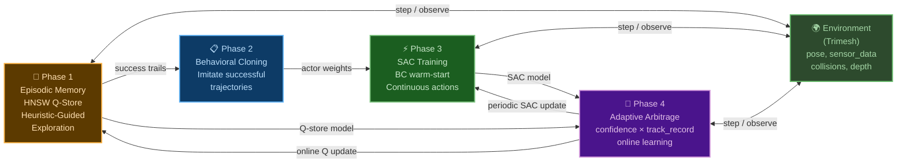

# Summary

## This is a prototype to implement, test and proof ideas below.

Replace the `JumpToGoalState` mixin in Monty's motor system with a model-free reinforcement learning (RL) agent that learns to navigate incrementally toward goal states provided by Learning Modules. Instead of teleporting the sensor to a target pose, the RL agent selects from existing Monty actions to move step-by-step toward the goal, learning from dense reward signals based on distance reduction.

My idea is to take the best practices and bring them closer to how the brain works.
Most similar in a practical sense is a hybrid of solutions:
### Episodic Memory  
- **Situation**: 'I've been in a similar situation before. What did I do then? What happened?'  
- **Algorithm**: HNSW + kNN + Gaussian Kernel Interpolation  
- **When to use**: At the begining of learning, novelty, rare / important events  
- **Characteristics**: One-shot / few-shot learning, Fast activation by similarity, High locality, poor generalization.

### Habits / skills  
- **Situation**: 'I've done this action many times under these conditions — it usually works well.'  
- **Algorithm**: Soft Actor-Critic (SAC) — parametric policy/value  
- **When to use**: During routine, automated actions, stable conditions  
- **Characteristics**: Slow learning over many repetitions, Generalization is highly effective

### Algorithm of arbitration between systems: when to trust memory and when to trust the network  
This is not a separate policy, but a mechanism for switching between behavior modes.

# Motivation

## Current Problem

The hypothesis-testing policy in Monty's Evidence Learning Module generates goal states — target poses where the sensor should move to gather disambiguating evidence about object identity. Currently, these goals are enacted by the `JumpToGoalState` mixin, which teleports the agent instantaneously to the target pose using `SetAgentPose`.
This teleportation approach has fundamental limitations as instantaneous teleportation has no biological or robotic analog. A real agent must navigate through space incrementally with collision awareness.

## Why kernel-based Q-learning with episodic memory (HNSW + kNN + Gaussian Kernel Interpolation)

### Biological Plausibility

The chosen approach (kernel-based Q-learning with episodic memory) has parallels to hippocampal memory systems:

- **Episodic storage**: Individual experiences stored as state-value pairs (analogous to hippocampal episode encoding)
- **One-shot / few-shot learning**: It is enough for a person to do something once in order to act similarly in a similar situation
- **Pattern completion**: KNN retrieval from partial state matches (analogous to hippocampal pattern completion)
- **Kernel generalization**: Smooth interpolation across similar experiences (analogous to memory generalization during retrieval)
- **Non-parametric**: No fixed-size weight matrix; memory grows with experience (analogous to ongoing hippocampal neurogenesis)

This aligns with Monty's broader goal of biologically plausible computation.

### Theoretical publications
- Ormoneit & Sen's (2002) 'Kernel-Based Reinforcement Learning' proposed and analyzed a variant of Q-learning for large state spaces, in which the Q-function is approximated by kernel regression on the data rather than by a neural network or table. A key contribution is the conditions under which such a 'kernel Q-learning' scheme converges.
- Blundell et al. (2016) 'Model-Free Episodic Control'. The agent remembers its past successful actions and returns and, when faced with a similar state, simply reproduces the best of what has already worked.

### HNSW + kNN + Gaussian Kernel Interpolation

Hierarchical Navigable Small World (HNSW) is an approximate nearest neighbor search algorithm based on a layered graph data structure. It belongs to the family of proximity graphs, where nodes (vertices) are connected based on their proximity, typically measured by the Euclidean distance.  
HNSW is currently actively used in embedding databases for searching similar text by vectors. So, I decided to use it to store and find states.  [What is State](#state-vector-15d)  
During the learning process, the agent stores experience in a graph and then uses the weighted past experience in a similar situation. Thehnically it looks like: store point in HNSW graph, then find the K closest ones and mix them with Gaussian kernel weights.
[Realization details here](src/tbp/hybrid_rl/hnsw_state_store.py)

### Why not only Deep Learing
I'm not opposed to deep learning. I agree that it's well suited for approximation, embedding, and many other tasks.  
I'm not suggesting replacing neural networks, I'm suggesting supplementing it and improving the learning process.

## You can read README_v1.md for details and questions before POC was implemented
[LINK](README_v1.md)

# Guide-level explanation
## Architecture Overview

The system has four phases. Training: Q-learning builds episodic memory, then Behavioral Cloning extracts successful trajectories, then SAC learns a parametric policy. Deployment: Adaptive Arbitrage decides per step whether to use Q-store, SAC, or heuristic fallback. All phases interact with the environment. Goals come from curriculum during training, and would come from the Learning Module in production.



Evidence LM's Goal-State Generator proposes the goal-state from the hypothesis-testing policy.
**goal_pose** = [x, y, z, pitch, yaw, roll]  
   ↓  
**RLGoalApproachController** computes **State Vector** using **goal_pose** as well as sensory patch input and proprioceptive information.   
   ↓  
**At the begining for new states** it needs to learn before inference.  
   ↓  
**RL Q-leraning with HNSW + kNN + Gaussian Kernel Interpolation** working with discrete actions. [What is Action](#montyactionspace)    
Actions are selected using [Heuristic-Guided Exploration](#heuristic-guided-exploration) approach. Objective: To obtain smart behavior and training data for SAC.  
HNSW graph points collection (gathering experience). Copying of **successful traces into replay buffer**.
**HNSWStateStore** stores **State Vector**, actions, Q-values.
Upon reaching a certain threshold of successful validation operations moves to next step of learning.    
   ↓  
**Behavioral cloning (BC)** — method of imitation learning in which an agent learns to imitate the behavior of an expert by directly copying his actions based on data. BC is the simplest form of imitation learning: we teach the robot's policy as a supervised learning task—to predict the action of an expert based on observation. It can be used as independent approach but usually used as supplement before SAC or other off-policy RL algorithm.
Translation of HNSW 18D discrete action space from replay buffer into Parameterized SAC continuous action space. Replacing of 8 direction MoveTangentially with one action with two parameters: angle_deg, distance. Others actions are stays the same. Main defference will be during SAC training when paramters can be any value, not fixed config free_step, rotation_step, surface_step.
   ↓  
**Train a SAC Actor policy using supervised learning loss** to have a continuous policy that copying the behavior of a discrete policy.  
   ↓  
**Warm-start to run RL SAC training with Critic policy** as well using the Actor policy weights from the BC.
Train with a reward (progress toward the goal, penalty for collisions) in real or sim environment.
The SAC refines the policy: it makes movements smoother and more accurate, adapting to new scenes.
**Now the policy doesn't just copy of a discrete policy, it optimizes**.  
   ↓  
In future when SAC is trained we use it as **skills to propose continuous actions**  

## Advantages of this scheme:
- Quick start with Q-learning and discrete actions – no need to wait for the SAC to learn from scratch.
- Stability – Heuristic-Guided Exploration learns in new areas.
- Precision – then SAC makes movements smooth and optimal as skills.
- Biologically plausible – like human learning: first we copy, then we hone.


**Below is explanation of the main components**:
## Adaptive Arbitrage

The adaptive arbitrage system is the deployment-time decision layer that combines all learned knowledge (Q-store, SAC, heuristics) and continues learning on new objects. It consists of two components: the **Arbitrator** (per-step action source selection) and the **AdaptiveTrainingManager** (episode-level performance monitoring and retraining).

### Arbitrator — Per-Step Action Source Selection

The Arbitrator decides which action source to use **on every step**. It receives proposals from Q-store and SAC, evaluates their reliability, and picks the best source.

[Full realization here](src/tbp/hybrid_rl/arbitrator.py)

#### Decision Logic

```
Step 1: Get proposals from all sources
  → Q-store: softmax sample from Q-values (with strategic detach override)
  → SAC: sample from actor network (continuous params)
  → Heuristic: geometric rules (fallback)

Step 2: Q-confident override
  IF q_confidence ≥ adaptive_threshold AND q_spread > 3.0:
    IF q_type == sac_type → use SAC params (Q confirms SAC = "blend")
    IF q_type != sac_type → use heuristic (conflict = neither trusted)

Step 3: Track record scoring
  Compute per-level success rates for Q, SAC, blend, heuristic
  IF worst_ML_track < heuristic_track AND heuristic_budget not exhausted:
    → use heuristic (ML is underperforming)

Step 4: Default
  → use SAC (or Q fallback if no SAC)
```

#### Key Design Decisions

**Per-level track records**: Success rates are tracked separately for each curriculum level. Level 0 (easy, 10-40mm) may have different source reliability than level 2 (hard, 10-120mm). Each source (Q, SAC, blend, heuristic) maintains a sliding window of 50 episode outcomes per level.

**Dynamic heuristic epsilon**: Instead of a fixed heuristic fallback rate, the budget is proportional to the gap between heuristic and ML performance:
```
heuristic_eps = max(h_track - worst_ml_track, 0.1)
```
When ML is close to heuristic performance → minimal heuristic usage (10%). When ML is far below → more heuristic (up to the full gap). This prevents heuristic from dominating when ML is learning, while providing a safety net when ML fails.

**Q-confidence with V-baseline**: Q-confidence from HNSW store is adjusted by the state value baseline:
- V above global mean → boost confidence (well-known good state)
- V below global mean → reduce confidence (unknown/bad state)

This prevents Q-store from being overconfident in unfamiliar regions.

**Agreement tracking**: When Q and SAC propose the same action type, the "blend" source is recorded. This tracks whether the two systems are converging — high agreement rate suggests both have learned similar policies.

**Episode attribution**: At episode end, the dominant source (most steps) determines which track record gets updated. This is a simplification — ideally each step's contribution would be weighted, but dominant-source attribution is robust and simple.

#### Source Selection Summary

| Source | When chosen | What it provides |
|--------|-------------|------------------|
| **Q-store** | High confidence, no SAC available | Discrete action → converted to type + params |
| **SAC** | Default when available, ML track ≥ heuristic | Continuous action type + params from actor network |
| **Blend** | Q and SAC agree on type, Q is confident | SAC params with Q confirmation (highest trust) |
| **Heuristic** | Q/SAC conflict, or ML underperforming heuristic | Geometric rules → discrete action → type + params |

### AdaptiveTrainingManager — Episode-Level Performance Monitor

The AdaptiveTrainingManager monitors rolling success rate and decides the training mode. It wraps the Arbitrator and manages online/offline learning.

[Full realization here](src/tbp/hybrid_rl/adaptive_manager.py)

#### Three Operating Modes

| Mode | Condition | Behavior |
|------|-----------|----------|
| **online** | 40-95% success rate (default) | Full Q-learning every step. Periodic SAC updates (critic CQL + actor with BC). Adaptive epsilon based on success rate |
| **mastered** | >95% success rate sustained | Light tuning only. Epsilon = 0.02. System has learned the object |
| **offline** | Best ML track < heuristic × 0.5, sustained | Emergency full retrain. Q-learning (500 ep, ε: 1.0→0.3) + SAC retrain (300 ep). Resets track records after |

#### Online SAC Updates

Every `online_sac_update_every` episodes (default 100), the manager performs a mini SAC training session:

1. **Critic warmup**: First N updates are critic-only (CQL). Actor is frozen to prevent catastrophic forgetting before critic has calibrated
2. **CQL critic**: Conservative Q-Learning prevents overestimation on the new object's state distribution
3. **Actor updates**: After warmup, actor updates every 10th step with reduced learning rate (×0.1) and strong BC regularization
4. **BC lambda decay**: Gradually frees actor from behavioral cloning constraint (×0.95 per update cycle)

Transitions are collected selectively:
- **Success trajectories**: Always collected (buffer + BC data)
- **Failure trajectories**: Collected with probability `min(0.3, success_rate × 0.5)` — critic needs some negatives but not too many

#### Offline Retrain Pipeline

Triggered when ML sources consistently underperform heuristics (with safeguards):
- Minimum `min_online_before_offline` episodes before first offline (default 300)
- Maximum `max_offline_iterations` total (default 2)
- Cooldown `post_offline_cooldown` episodes after each offline (default 200)

The offline pipeline:
1. Save current Q-store
2. Run Q-learning training (`offline_q_episodes`, default 500) with warmup and curriculum
3. Reload improved Q-store, reset Arbitrator track records
4. If SAC available and enough success trails: retrain SAC with combined BC data (old objects + new trails)
5. Reset success history, enter online mode

#### Mode Transition Diagram

```
                    ┌──────────┐
         ┌─────────│  online   │◄────────────┐
         │         └────┬──────┘             │
         │              │                     │
    success > 95%   ML << heuristic      post-retrain
         │              │                     │
         ▼              ▼                     │
   ┌──────────┐   ┌──────────┐               │
   │ mastered │   │ offline  │───────────────┘
   └──────────┘   └──────────┘
         │              
    success < 95%       
         │              
         └──────► online
```

### Integration: How Arbitrator and Manager Work Together

```
Episode loop:
  1. Manager.get_action(state, pose, sensor)
     → Arbitrator.decide() → (action_type, params, source)
  2. Environment.step(action)
  3. Controller.update_only() → Q-store learns from transition
  4. Repeat until done

  5. Manager.on_episode_complete(success, transitions)
     → Update success history
     → Arbitrator.on_episode_end(success) → update track records
     → decide_mode() → online/mastered/offline
     → If online: collect transitions, maybe SAC update
     → If offline: trigger full retrain pipeline
     → If mastered: reduce epsilon to 0.02
```

> "The key insight is that the Arbitrator operates at step level (which source per action) while the Manager operates at episode level (how to train). The Arbitrator doesn't know about training — it just picks the best source based on track records. The Manager doesn't know about individual actions — it just monitors success rate and triggers retraining when needed. This separation keeps both components simple and testable."

---

## State Vector (22D)
The agent sees a 22-dimensional state vector. Everything is in the agent's local coordinate frame — this is important for generalization, because going from A to B requires the same actions regardless of absolute position in the world.
Five groups of features:

> **Where is the goal?** Position error — 3D direction to goal. Rotation error — how much to turn. Distance — scalar. These tell the agent 'the goal is 30mm ahead and to the left.'
>
> **What surface am I on?** Surface normal, principal curvatures (k1, k2), on_object flag, normalized depth. These tell the agent 'I'm on a curved wall' or 'I'm in the air.'
>
> **How is the goal oriented relative to the surface?** Alignment — dot product of goal direction and surface normal. When it's negative, the goal is behind the surface, and the agent needs to detach and fly. When it's positive, the agent can crawl along the surface.
>
> **Goal surface context.** Goal normal in agent's local frame — tells the agent how the goal surface is oriented relative to current position. Path blocked flag — whether direct line to goal intersects the object. Movement efficiency — ratio of net displacement to total movement over recent steps, detecting oscillation/stagnation.
>
> **Projected goal direction.** 2D projection of goal direction onto the tangent plane (when on surface) or onto the XY plane of the agent frame (when in air). Gives the agent a direct signal for which surface direction to crawl.
>
> The state is action-space independent — it describes the situation, not what actions are available.

I started with 13D, expanded to 15D (adding curvatures), then to **22D** during development. The additional features (goal normal, path blocked, movement efficiency, projected direction) significantly improved navigation on complex objects like mugs and cups.

| Index | Feature | Description |
|----------|----------|----------|
| 0-2   | position_error [x, y, z]   | direction to goal in agent's local frame   |
| 3-5   | rotation_error [pitch, yaw, roll]   | orientation error (normalized angles)   |
| 6-8   | local_normal   | surface normal in agent's local frame   |
| 9   | k1   | principal curvature (max absolute)   |
| 10   | k2   | principal curvature (min absolute)   |
| 11   | on_object   | whether sensor on object surface   |
| 12   | alignment   | dot(goal_direction, surface_normal)   |
| 13   | distance   | Euclidean distance to goal   |
| 14   | norm_depth   | normalized depth to nearest surface   |
| 15-17 | goal_normal_local | goal surface normal in agent's local frame |
| 18 | path_blocked | whether direct path to goal is blocked by object (0/1) |
| 19 | movement_efficiency | net displacement / total movement over recent window (0..1) |
| 20-21 | projected_goal_2d | goal direction projected onto tangent plane (on surface) or agent XY plane (in air) |

### Strategic State Vectors

In addition to the main 22D tactical state, the system uses two compact strategic state vectors for high-level decisions. These are stored in separate HNSW graphs (`strategic_detach` and `strategic_direction`) and control phase transitions rather than individual actions.

#### Detach Decision State (5D)
Used to decide whether to stay on surface (crawl) or switch to air (detach). Stored in `strategic_detach` Q-store with 2 actions: stay=0, switch=1.

| Index | Feature | Description |
|-------|---------|-------------|
| 0 | normal_agreement | dot(agent_normal, goal_normal) — are agent and goal on same side? |
| 1 | alignment | dot(goal_direction, agent_normal) — is goal reachable by crawling? |
| 2 | norm_distance | distance / object_extent — relative distance to goal |
| 3 | path_blocked | whether direct path to goal is blocked (0/1) |
| 4 | movement_efficiency | recent crawl efficiency — detects stagnation |

#### Direction Decision State (5D)
Used when in air to decide whether to fly directly to goal (action=0) or bypass/orbit around obstacle (action=1). Stored in `strategic_direction` Q-store with 2 actions: fly_to_goal=0, bypass=1.

| Index | Feature | Description |
|-------|---------|-------------|
| 0 | lateral_deviation | how far off-axis the goal is (0=ahead, 1=side) |
| 1 | alignment | dot(goal_direction, agent_normal) |
| 2 | norm_distance | distance / object_extent — relative distance |
| 3 | angle_to_goal | dot(forward, goal_direction) — how well aimed at goal |
| 4 | path_blocked | whether direct path is blocked (0/1) |

> "The strategic states are intentionally compact (5D vs 22D). High-level decisions like 'should I detach?' depend on a few geometric relationships, not on fine-grained curvature or exact position. Compact states mean the strategic Q-stores learn faster with fewer samples and generalize better across objects. Strategic state are used only for Q-stores, SAC as neaural network is able to find similar dependencies from 22D tactical state"


## ActionSpace (24D) - What agent can do
There are 24 discrete actions in four categories.

> "**Surface movement** — 8 directions of MoveTangentially, plus OrientHorizontal and OrientVertical. This is crawling along the object surface.
>
> **Free movement** — MoveForward in three step sizes: normal 8mm, small 2mm, and backward 2mm. This is flying through air.
>
> **Orientation** — TurnLeft, TurnRight, LookUp, LookDown, each in normal and big step sizes. 5 degrees and 15 degrees. Big steps for coarse correction, small for fine-tuning.
>
> **Macro actions** — Detach. These are multi-step sequences. Detach lifts off the surface along the normal and orient gaze toward goal.
>
> The action space is a configurable parameter. Adding or removing actions doesn't require architectural changes

### How to use action types in RL step by step:
1. Q-learning and discrete actions - 'What to do' (high level primitives with fixed parameters)
The policy outputs an index from 0 to 24.  
Fixed directions, surface_step, free_step, rotation_step are used.  
2. Parameterized SAC (current proposal)  - 'What to do' (high level primitives with continious parameters) 
The policy outputs: action index (0-8) and a continuous parameter instaed of fixed step.
Replacing of 8 direction MoveTangentially with one action with two parameters: angle_deg, distance. Others actions are stays the same.
3. Purely continuous SAC - Skipped, reasons: Loss of interpretability, Difficulty of learning, Loss of domain knowledge, Incompatibility with high level primitives  
The policy outputs a vector [Δx, Δy, Δz, Δθ, Δφ] and then interprets this as a combined motion.
4. Mathematical controller (Low-level / Inverse kinematics & Impedance)
This is 'spinal cord' that receives a command from the neural network (SAC) and instantly calculates the motor actions.

At the beginning I used 18 actions then 1 macro actions and 5 different step / rotation size actions were added:
### Discrete action space 24D
| Index | Action               | Description                                                                 | Mode     | Parameters |
|--------|------------------------|-------------------------------------------------------------------------|-----------|-----------|
| 0–7    | MoveTangentially       | Movement tangent to the surface in 8 directions: 0°, 45°, ..., 315° | surface   | `distance: float`, `direction: VectorXYZ` |
| 8      | MoveForward            | Moving forward (in the direction the agent is looking)              | both       | `distance: float` |
| 9      | MoveForward (neg)      | Moving backward                                                          | both       | `distance: float` |
| 10     | TurnLeft               | Rotate the agent to the left (along the Y axis, yaw)                  | distant   | `rotation_degrees: float` |
| 11     | TurnRight              | Rotate the agent to the right                                            | distant   | `rotation_degrees: float` |
| 12     | LookUp                 | Tilt the agent/sensor up (pitch)                                      | distant   | `rotation_degrees: float` |
| 13     | LookDown               | Tilt the agent/sensor down                                              | distant   | `rotation_degrees: float` |
| 14     | SetSensorRotation (+)  | Rotate the sensor clockwise around the normal (yaw)                          | both       | `rotation_quat: Quaternion` |
| 15     | SetSensorRotation (-)  | Rotate the sensor counterclockwise                                          | both       | `rotation_quat: Quaternion` |
| 16     | OrientHorizontal       | Correction of position and orientation in the horizontal plane (with compensation) | surface   | `rotation_degrees: float`, `left_distance: float`, `forward_distance: float` |
| 17     | OrientVertical         | Correction of position and orientation in the vertical plane                | surface   | `rotation_degrees: float`, `down_distance: float`, `forward_distance: float` |
| 18 | Detach | macro | Detach from surface along normal and orient gaze toward goal |
| 19 | MoveForward Small | free | MoveForward on small step |
| 20 | LOOK_UP_BIG | orient | look up at big rotation |
| 21 | LOOK_DOWN_BIG | orient | look down at big rotation |
| 22 | TURN_LEFT_BIG | orient | turn left at big rotation |
| 23 | TURN_RIGHT_BIG | orient | turn right at big rotation |

- **Action steps:** Smaller steps reduce collisions but increase episode step length. After many iterartions values were choosen:
   - surface_step: 3.0
   - free_step: 8.0
   - free_step_small: 2.0
   - rotation_step: 5.0
   - rotation_step_big: 15.0
   - free_step_backward: 2.0


## HNSWStateStore
Update state → normalize (with feature weights) → KNN search
→ if near existing point: update it
→ else: insert new point with interpolated init

Get state → normalize (with feature weights) → KNN search → kernel interpolation → Q-values

> "One important design decision: I split the Q-store into **four** separate HNSW graphs:
> - **q_store_surface** — tactical actions when on the object surface
> - **q_store_free** — tactical actions when in the air
> - **strategic_detach** — high-level detach/stay decisions (5D state, 2 actions)
> - **strategic_direction** — high-level fly-to-goal/bypass decisions (5D state, 2 actions)
>
> The same position in space requires opposite strategies depending on whether you're touching the surface. On the surface — crawl. In the air — steer and fly. Mixing them in one store confused the learning. Similarly, strategic decisions operate on different features and timescales than tactical action selection, so they get their own stores."

### Key improvements since initial prototype

- **Feature weights**: Per-store configurable weights that boost strategic features in the HNSW distance computation. Surface store and free store can emphasize different state dimensions, so HNSW better distinguishes crawl vs detach states.

- **Normalization freeze**: Running mean/std statistics are computed during a warmup period (`norm_warmup_steps`, default 5000), then frozen. After freeze, the HNSW index is rebuilt with final normalization. This prevents normalization drift from distorting distances between early and late points.

- **Auto-calibration of insert threshold**: The `insert_threshold` (which controls whether to update an existing point or insert a new one) can be automatically calibrated from observed nearest-neighbor distances. This adapts point density to the actual state space coverage.

- **Fast save/load with native HNSW index**: `save_with_index` / `load_with_index` persist the native hnswlib binary alongside point data, avoiding O(N log N) rebuild on load. Falls back to rebuild if the binary is incompatible.

- **Confidence estimation**: `get_q_values_with_confidence` returns not just Q-values but a confidence score composed of proximity (how close are neighbors), experience (how often were they visited), and consistency (do neighbors agree on best action). Used by the v2 action selection to dynamically control Q-trust vs heuristic reliance.

[Realization details here](src/tbp/hybrid_rl/hnsw_state_store.py)


## Reward Function
> "The reward signal is computed entirely locally in the motor system. No involvement from Learning Modules or CMP. The reward function is **phase-aware** — the same physical event (e.g. moving away from goal) gets different rewards depending on whether the agent is crawling to goal, bypassing an obstacle, or landing."

The reward has evolved from a simple progress + terminal structure to a multi-component system that shapes behavior across all navigation phases:

| Component | Reward | Done? | When |
|:----------|-------:|:-----:|:-----|
| **Progress (per step)** | ~+3.0 | No | `(prev_dist - dist) / surface_step × 3.0`. Phase-aware: reduced penalty during FLY_TO_EDGE and CRAWL_TO_EDGE when moving away from goal is expected |
| **Subgoal shaping** | ±3.0 | No | Potential-based shaping (Ng et al. 1999). Encourages moving toward object edge when goal is behind surface (alignment < 0). Preserves optimal policy |
| **Goal reached** | +60.0 | Yes | `distance < goal_threshold (4mm)` |
| **Step penalty** | -0.5 | No | Every step — encourages efficient paths |
| **Stagnation penalty** | -0.3 | No | When movement_efficiency < 0.1 on surface — agent is oscillating |
| **Surface violation** | -12.0 | Yes | Agent passed through object (depth < min_valid_depth or normal flipped) |
| **Detach collision** | -12.0 | Yes | Collision during macro detach action |
| **Lost object** | -3.0 | No | Fell off surface unexpectedly (not from intentional detach) |
| **Timeout** | -12.0 | Yes | `steps >= max_steps_per_goal` |
| **Near goal on surface** | +0.5 | No | `distance < 3 × surface_step` AND `on_object = true` |
| **Successful landing** | up to +8.0 | No | Transitioned from air to surface without collision, on correct side. Reward scales with landing quality: `8.0 × max(0, 1 - distance / landing_radius)` |
| **Correct crawl bonus** | +0.2 | No | On surface, phase=CRAWL_TO_GOAL, making positive progress |
| **Fly alignment improvement** | ±2.0 | No | In air: reward for improving forward alignment with subgoal (FLY_TO_EDGE) or goal (FLY_TO_GOAL/LAND). Penalizes turning away |
| **Risky free on surface** | -2.0 | No | MoveLinear action while on surface — high collision risk |
| **Flying too far** | -2.0 | No | Distance > 1.5 × object_extent while in air — drifting away |
| **Detach in air** | -5.0 | No | Detach action when already in air — wasteful |

### Phase-aware progress

The progress reward adapts to the current navigation phase:
- **CRAWL_TO_GOAL / FLY_TO_GOAL**: Full progress reward — moving toward goal is the objective
- **FLY_TO_EDGE**: Negative progress scaled to 20% — agent may temporarily move away from goal while bypassing obstacle, and that's expected
- **CRAWL_TO_EDGE / DETACH_NEEDED**: Progress scaled to 10% — crawling to edge often increases goal distance
- **Detour mode**: When alignment < threshold and on surface, negative progress is clipped to prevent large penalties for necessary detours

### Subgoal potential shaping

Based on Ng et al. (1999) potential-based reward shaping, which provably preserves the optimal policy:

```
φ(s) = (1 + alignment) × SCALE    when alignment < 0 and on_object
φ(s) = (1 + alignment) × SCALE × 0.3   when alignment < 0 and in air
φ(s) = 0                           when alignment ≥ 0

shaping_reward = γ × φ(s') - φ(s)
```

This encourages the agent to move toward the object edge (where alignment → 0) when the goal is behind the surface, without distorting the optimal policy.

Details of logic here: `def compute_common_reward` and `def _compute_reward`
[LINK](src/tbp/hybrid_rl/rl_goal_approach_controller.py)


## Heuristic-Guided Exploration
> "Before Q-learning has any experience, the agent needs reasonable behavior from step one. That's what heuristics provide. They are geometric rules that bias action selection. The heuristic system has evolved from simple directional rules to a **phase-driven architecture** where the current navigation phase determines which heuristic components are active."

### Phase System

The agent operates in one of six phases, determined by `_determine_phase()` based on geometric analysis of the current situation:

| Phase | Condition | Behavior |
|-------|-----------|----------|
| **CRAWL_TO_GOAL** | On surface, same side, path clear | Crawl along surface toward goal using geodesic direction |
| **CRAWL_TO_EDGE** | On surface, different side or path blocked, still making progress | Crawl toward nearest edge/rim to transition to other side |
| **DETACH_NEEDED** | On surface, different side or path blocked, stuck (low movement efficiency) | Lift off surface — strategic detach decision |
| **FLY_TO_GOAL** | In air, path clear | Steer and fly directly toward goal |
| **FLY_TO_EDGE** | In air, path blocked | Orbit/bypass around object toward edge |
| **LAND** | In air, close to goal or emergency (depth < 5mm) | Careful approach with small steps, suppress large movements |

Phase transitions include **hysteresis** — when path becomes clear during FLY_TO_EDGE, the agent continues bypassing for 3 steps before switching to FLY_TO_GOAL, preventing oscillation.

**Horizontal surface detection**: On horizontal surfaces (normal aligned with up_direction > 85°), the agent skips CRAWL_TO_EDGE/DETACH_NEEDED and stays in CRAWL_TO_GOAL, because crawling on a rim naturally leads to edge traversal.

### Heuristic Components

The heuristic bias is composed of seven independent components, each producing a score vector over all actions:

| # | Component | Active when | Description |
|---|-----------|-------------|-------------|
| 0 | **Suppress** | Always | Suppresses detach (strategic decision), sensor rotations, and orient actions (except near goal). Anti-spam guards for consecutive detach |
| 1 | **Surface move** | On surface | Phase-aware tangential direction scoring. CRAWL_TO_GOAL: geodesic direction using goal normal for great-circle path, with direction hysteresis. CRAWL_TO_EDGE: direction toward edge/rim using subgoal direction. Horizontal rim: blend of goal direction and away-from-center for edge descent |
| 2 | **Stagnation** | On surface, CRAWL phases | If no progress in 10 steps: penalize current direction, boost perpendicular and opposite directions |
| 3 | **Steer in air** | In air | Phase-driven steering. Simulates 4 rotations, picks best alignment with effective goal (subgoal for FLY_TO_EDGE, goal for FLY_TO_GOAL). Three regimes: TURN_ONLY (>45°), FLY+TURN (>20°), FLY (aligned). Big rotations for coarse correction, small for fine-tuning. Trapped detection near surface |
| 4 | **Damp free on surface** | On surface | Strongly suppresses free movement, big rotations, and orient actions — these are dangerous on surface |
| 5 | **Flyby correction** | In air, not FLY_TO_EDGE | Detects when agent is flying past goal (distance increasing). Suppresses forward movement, boosts corrective rotations. Escalates with consecutive flyby count |
| 6 | **Orientation cooldown** | On surface | Tracks orientation actions that produce no distance change. After 3 no-effect uses, progressively penalizes that action |
| 7 | **Landing** | In air, LAND/FLY phases | Near goal: suppress large forward, boost small forward. Emergency (depth < 5mm): only small forward allowed. Overshoot detection: if distance exceeds recent minimum by > free_step, hard suppress forward |

### Two-Level Decision Architecture

Action selection operates on two levels:

**Strategic level** — decides phase transitions using dedicated Q-stores:
- **Detach decision** (`strategic_detach`, 5D state, 2 actions): Should the agent stay on surface or detach? Blends strategic Q-values with geometric heuristic using strategic epsilon. Retrospective learning: after episode ends, updates detach Q-values based on whether detach actually helped (changed same_side, unblocked path, led to success/collision/timeout)
- **Direction decision** (`strategic_direction`, 5D state, 2 actions): In air, should the agent fly to goal or bypass? Uses path_blocked and angle_to_goal. Updated retrospectively based on episode outcome

**Tactical level** — selects specific action within the phase determined by strategic level.

### Transition Schedule

| Phase | Epsilon | Behavior |
|---|-----------|--------|
| Warmup | fixed | Pure heuristic with greedy selection — reasonable from step 1 |
| Cold start | 1.0 → 0.5 | v1: mostly heuristic. v2: low Q-trust, heuristic dominant |
| Learning | 0.5 → 0.1 | v1: blend shifts to Q. v2: Q-trust grows with confidence |
| Inference | 0.1 → 0.02 | v1: mostly Q with heuristic safety net. v2: high Q-trust where data exists, heuristic fallback elsewhere |

A small fraction (5% × ε) of actions remain purely random to guarantee full action space coverage.

**Limitation:** Heuristic biases reference specific action indices (e.g., `IDX_DETACH`, `IDX_FREE_FORWARD`). For a different action space, heuristics would need to be adapted. This is by design — heuristics encode domain-specific geometric reasoning that depends on what actions are available.

[Realization details: `_compute_heuristic_bias`, `_determine_phase`, `_choose_action_v2`](src/tbp/hybrid_rl/rl_goal_approach_controller.py)


## Lightweight Enviroment
To fast test hypophesys and ideas we need to create relevant approximation of Habitat, especially for training policies based on haptics/active perception.
It should not simulate graphics, but it should accurately reproduces the key physics that are important for training: contact, normals, ray casting, movement on surfaces.
I suggest to use Trimesh python library for loading and using triangular meshes with an emphasis on watertight surfaces. https://github.com/mikedh/trimesh
The Lightweight Environment (Trimesh) proved essential for rapid iteration — each experiment takes ~ several hours to test on my laptop
[Details are here](src/tbp/hybrid_rl/lightweight_env.py)

### Objects
[Sizes and realization are](src/tbp/hybrid_rl/mesh_factory.py)
[Pictures are](results_publish/objects)


# Main Proof of Concept Results

The prototype has been implemented and tested on the Lightweight Environment (Trimesh-based). Below are the key results that I hope confirm the ideas from the RFC.

## Pipeline Validation
**The full pipeline works end-to-end: Q-learning → Behavioral Cloning → SAC → Arbitrage**


### Evaluation Results

#### Training and Evaluation Setup

Training used curriculum with geometric filters to progressively increase difficulty:

| Level | Distance (mm) | Filter | Description |
|-------|:------------:|--------|-------------|
| L0 | 10-60 | same_side=true, path_blocked=false | Easy: goal visible, direct path |
| L1 | 10-80 | same_side=true, path_blocked=true | Medium: goal on same side but path blocked by surface curvature |
| L2 | 10-120 | same_side=false | Hard: goal on opposite side of object, requires detach/fly/land |

All methods trained on: cube, sphere, cylinder, flat_square, cone, thin_cylinder, vase, mug.
**Cup is unseen** during training — generalization test.
100 episodes per level per object.

#### Q-Learning training
    # ═══════════════════════════════════════════
    # PHASE 1: Primitives (from scratch)
    # ═══════════════════════════════════════════
    training_stages:
      # ── Phase 1: Primitives ──
      - mesh: cube
        episodes: 1000
        epsilon_start: 1.0
        epsilon_min: 0.15
        load_mode: null
        warmup_episodes: 100
        promote_threshold: 0.85
        promote_window: 200
        curriculum_filters:
          - {same_side: true, path_blocked: false}
          - {same_side: true, path_blocked: true}
          - {}

      - mesh: sphere
        episodes: 1000
        epsilon_start: 1.0
        epsilon_min: 0.12
        load_mode: auto
        warmup_episodes: 80
        promote_threshold: 0.85
        promote_window: 200
        curriculum_filters:
          - {same_side: true, path_blocked: false}
          - {same_side: true, path_blocked: true}
          - {}

      - mesh: cylinder
        episodes: 1000
        epsilon_start: 1.0
        epsilon_min: 0.10
        load_mode: auto
        warmup_episodes: 80
        promote_threshold: 0.85
        promote_window: 200
        curriculum_filters:
          - {same_side: true, path_blocked: false}
          - {same_side: true, path_blocked: true}
          - {}

      - mesh: flat_square
        episodes: 1000
        epsilon_start: 1.0
        epsilon_min: 0.10
        load_mode: auto
        warmup_episodes: 80
        promote_threshold: 0.8
        promote_window: 200
        curriculum_filters:
          - {same_side: true, path_blocked: false}
          - {same_side: true, path_blocked: true}
          - {}
      
      - mesh: cone
        episodes: 1000
        epsilon_start: 1.0
        epsilon_min: 0.10
        load_mode: auto
        warmup_episodes: 80
        promote_threshold: 0.8
        promote_window: 200
        curriculum_filters:
          - {same_side: true, path_blocked: false}
          - {same_side: true, path_blocked: true}
          - {}

      - mesh: thin_cylinder
        episodes: 1000
        epsilon_start: 1.0
        epsilon_min: 0.10
        load_mode: auto
        warmup_episodes: 80
        promote_threshold: 0.85
        promote_window: 200
        curriculum_filters:
          - {same_side: true, path_blocked: false}
          - {same_side: true, path_blocked: true}
          - {}

      # ── Phase 2: Hollow objects ──
      - mesh: vase
        episodes: 2000
        epsilon_start: 1.0
        epsilon_min: 0.10
        load_mode: auto
        warmup_episodes: 100
        promote_threshold: 0.70
        promote_window: 300

      - mesh: mug
        episodes: 2000
        epsilon_start: 1.0
        epsilon_min: 0.10
        load_mode: auto
        warmup_episodes: 100
        promote_threshold: 0.7
        promote_window: 300

      # ── Phase 3: Reinforcement on new points ──
      - mesh: vase
        episodes: 1000
        epsilon_start: 0.3
        epsilon_min: 0.08
        load_mode: auto
        pool_seed: 201
        warmup_episodes: 30
        promote_threshold: 0.70
        promote_window: 200

      - mesh: mug
        episodes: 1000
        epsilon_start: 0.3
        epsilon_min: 0.08
        load_mode: auto
        pool_seed: 202
        warmup_episodes: 30
        promote_threshold: 0.7
        promote_window: 200

#### Q-Learning Evaluation

| Object | L0 | L1 | L2 | Avg |
|--------|:-:|:-:|:-:|:-:|
| **sphere** | 100% | 100% | 100% | **100%** |
| **cube** | 100% | 100% | 90% | **97%** |
| **cylinder** | 100% | 97% | 94% | **97%** |
| **thin_cylinder** | 100% | 96% | 92% | **96%** |
| **vase** | 100% | 100% | 72% | **90%** |
| **flat_square** | 100% | 97% | 48% | **82%** |
| **cone** | 95% | 68% | 76% | **80%** |
| **cup** ★ | 98% | 69% | 69% | **79%** |
| **mug** | 99% | 72% | 65% | **78%** |

####  ═══ BC balancing ═══
    bc_mesh_weights:
    # simple, but provides basic flat surface skills and edge traversal
      cube: 0.8         
      sphere: 0.8       
      cylinder: 1.5      
      flat_square: 0.5   
      cone: 0.5
      thin_cylinder: 0.5
      # hollow navigation
      vase: 2.0    
      # handle+rim   
      mug: 2.5           

    bc_level_weights:
      0: 1.0
      1: 1.5
      2: 2.0    

#### SAC Training
    sac_episodes_per_mesh:
      cube: 500
      sphere: 500
      cylinder: 500
      flat_square: 500
      cone: 500
      thin_cylinder: 500
      vase: 1000
      mug: 1000

#### SAC Evaluation

| Object | L0 | L1 | L2 | Avg |
|--------|:-:|:-:|:-:|:-:|
| **sphere** | 100% | 100% | 100% | **100%** |
| **thin_cylinder** | 100% | 100% | 100% | **100%** |
| **cylinder** | 100% | 100% | 98% | **99%** |
| **cube** | 100% | 100% | 94% | **98%** |
| **vase** | 100% | 100% | 68% | **89%** |
| **flat_square** | 100% | 86% | 66% | **84%** |
| **mug** | 100% | 87% | 64% | **84%** |
| **cup** ★ | 93% | 89% | 66% | **83%** |
| **cone** | 96% | 66% | 74% | **79%** |

#### Heuristic-Only Evaluation

| Object | L0 | L1 | L2 | Avg |
|--------|:-:|:-:|:-:|:-:|
| **thin_cylinder** | 100% | 99% | 99% | **99%** |
| **cylinder** | 100% | 96% | 94% | **97%** |
| **cube** | 100% | 98% | 91% | **96%** |
| **vase** | 99% | 98% | 90% | **96%** |
| **sphere** | 100% | 95% | 89% | **95%** |
| **cup** | 99% | 84% | 85% | **89%** |
| **mug** | 100% | 76% | 78% | **85%** |
| **cone** | 95% | 67% | 78% | **80%** |
| **flat_square** | 100% | 88% | 51% | **80%** |

★ = unseen during training (generalization test)

#### Cross-Method Comparison (Average across all levels)

| Object | Q-Learning | SAC | Heuristic |
|--------|:-:|:-:|:-:|
| **sphere** | 100% | 100% | 95% |
| **thin_cylinder** | 96% | 100% | 99% |
| **cylinder** | 97% | 99% | 97% |
| **cube** | 97% | 98% | 96% |
| **vase** | 90% | 89% | 96% |
| **flat_square** | 82% | 84% | 80% |
| **mug** | 78% | 84% | 85% |
| **cone** | 80% | 79% | 80% |
| **cup** ★ | 79% | 83% | 89% |
| **Average** | **89%** | **91%** | **89%** |

#### Key Findings

**1. Learned policies match hand-crafted heuristics.** Q-learning (89% avg) and SAC (91% avg) achieve performance on par with carefully engineered geometric heuristics (89% avg). This is significant because the heuristics encode months of domain-specific geometric reasoning (geodesic crawling, orbit computation, flyby correction, landing control), while Q-learning and SAC learned equivalent behavior from reward signal alone. SAC slightly outperforms both on average, confirming that the BC warm-start → SAC refinement pipeline works.

**2. Generalization to unseen objects works.** Cup was never seen during training. Q-learning achieves 79%, SAC 83%, heuristic 89% on cup — comparable to performance on trained objects like mug (78%/84%/85%) and cone (80%/79%/80%). This confirms the hypothesis that the 22D state vector captures fundamental geometric relationships (alignment, curvature, path_blocked, normal_agreement) rather than object-specific features. The agent has learned to navigate *geometry*, not specific objects.

**3. Q-store serves as a knowledge base for the full pipeline.** The training pipeline flows: Q-learning builds episodic memory → successful trajectories extracted → Behavioral Cloning trains SAC actor → SAC refines with RL. Each stage builds on the previous. Q-store accumulates geometric experience across objects (1,156 strategic detach points, 9,544 strategic direction points), which transfers to new objects. SAC then smooths and generalizes this discrete experience into continuous actions.

**4. Heuristics provide a strong baseline and safety net.** The heuristic system is not just a bootstrap — it remains competitive at all levels. On complex objects at L2, heuristics sometimes outperform learned policies (vase: 90% heuristic vs 72% Q-learning, cup: 85% vs 69%). This validates the two-level architecture: heuristics handle geometric reasoning reliably, while learned policies add value through experience-based corrections and continuous action parameters.

**5. L2 (opposite sides) remains the primary challenge.** All methods show significant degradation at L2 where the goal is on the opposite side of the object. The failure mode is predominantly timeout — the agent navigates safely but runs out of steps during detach→fly→land sequences. Flat_square is the hardest (48-66% at L2) because its thin geometry makes edge detection and landing particularly difficult.

This complementarity is exactly what the Adaptive Arbitrage system exploits — selecting the best source per step based on track records.

#### Adaptive Arbitrage Evaluation (Cup — unseen object, 2000 episodes)

The adaptive mode combines Q-store, SAC, and heuristics with online learning on a completely new object (cup). The system starts with models trained on 8 other objects and adapts in real-time.

**Overall: 83% rolling success rate at Level 2 after 2000 episodes.**

| Metric | Value |
|--------|-------|
| Total episodes | 2,000 |
| Rolling success rate (last 100) | 83% |
| Total success rate | 72.9% |
| Final curriculum level | 2 (hardest) |
| Mean steps per success | 51.0 |
| Online SAC updates | 20 |
| Offline retrains triggered | 0 |

[Details are here](results_publish/adaptive_logs_cup)

##### Source Distribution

| Source | Step Rate | Success Rate | Role |
|--------|:-:|:-:|------|
| **Blend** (Q confirms SAC) | 51.5% | 85.3% | Primary — highest trust, Q validates SAC |
| **SAC** (standalone) | 25.6% | 83.3% | Secondary — when Q not confident enough to confirm |
| **Heuristic** (fallback) | 23.0% | 72.2% | Safety net — when ML underperforms |
| **Q-store** (standalone) | 0.0% | — | Not used alone — always confirms or defers to SAC |

Q-SAC agreement rate: **79%** — the two systems converge on the same action type in 4 out of 5 steps.

##### Per-Level Performance

| Level | Blend | SAC | Heuristic | Best |
|-------|:-:|:-:|:-:|:-:|
| L0 (easy) | 92% | 97% | — | SAC |
| L1 (medium) | 88% | 95% | — | SAC |
| L2 (hard) | 63% | 71% | 72% | Heuristic |

At L2, heuristic budget increases to 24% (from 5% at L0) because ML sources drop below heuristic track record. The arbitrator automatically allocates more steps to heuristics where they outperform learned policies.

##### Why Q-Store Matters (Even When Heuristics Exist)

> "If heuristics achieve 89% average, why do we need Q-store at all?"

Heuristics are hard-coded geometric functions — they work well but have fundamental limitations:

1. **Heuristics can't learn from experience.** A heuristic that fails on a specific geometry will fail the same way every time. Q-store records what worked and what didn't, building a growing knowledge base. After 2000 episodes on cup, the strategic_direction store grew from 9,544 to 9,555 points — each new point is a learned geometric situation.

2. **Q-store enables confidence-based arbitration.** SAC (as a neural network) always outputs high-confidence predictions — it has no mechanism to signal "I don't know." Q-store provides this missing signal: high confidence + high spread means "I've seen this situation many times and know what to do." Low confidence means "this is unfamiliar territory." The Arbitrator uses Q-confidence to decide when to trust SAC (blend mode, 85.3% success) vs when to fall back to heuristics (72.2% success). Without Q-confidence, every SAC action would be trusted equally, losing the 13% advantage of blend over heuristic.

3. **Q-store is a knowledge base that can be populated from multiple sources.** Currently Q-store learns from:
   - Online Q-learning updates (every step during adaptive mode)
   - Retrospective success backup (propagating rewards along successful trajectories)
   - Strategic detach/direction learning (episode-end retrospective updates)

   In the future, Q-store can be populated from:
   - **Demonstration learning**: Recording successful robot trajectories and inserting state-action-value triples directly into HNSW graph
   - **Sim-to-real transfer**: Pre-populating Q-store from simulation, then refining with real-world experience
   - **Multi-agent knowledge sharing**: Merging Q-stores from multiple robots operating on different objects
   - **Model-based planning**: Using Monty's learned reference frames as a world model to simulate trajectories and pre-populate Q-values for unvisited states (Dyna-Q style)
   - **Human corrections**: An operator marks a state as "detach here" or "don't detach here", directly updating strategic Q-values

   Heuristics cannot absorb any of these knowledge sources — they are fixed functions. Q-store is an open knowledge base with a universal insert interface: `update_q_value(state, action, value)`.

4. **Q-store provides the training signal for SAC.** Successful trajectories from Q-learning episodes are extracted, converted to continuous action space via Behavioral Cloning, and used to warm-start SAC. Without Q-store, SAC would need to learn from scratch — which is significantly slower and less stable. The pipeline Q-store → BC → SAC is what enables SAC to achieve 83% on an unseen object from episode 1.

##### Adaptive Mode Dynamics

The system self-regulates without manual intervention:

- **L0-L1**: SAC dominates (95-97% success), heuristic budget stays at minimum (5-10%). The system trusts learned policies.
- **L2**: SAC drops to 71%, heuristic budget automatically increases to 24%. The arbitrator detects ML underperformance and allocates more steps to the reliable fallback.
- **Blend mode** (Q confirms SAC) consistently outperforms standalone SAC at L0-L1 (92% vs 97% — SAC is better alone on easy tasks) but provides the critical safety check at L2 where SAC's confidence doesn't correlate with actual success.

### Areas for Improvement

**1. SAC online learning shows limited improvement.** After 20 online SAC updates during 2000 adaptive episodes, SAC success rate did not significantly increase. The likely causes:
- CQL critic is conservative by design — prevents overestimation but also slows learning
- Actor updates are heavily regularized (BC lambda, reduced lr, every 10th step) to prevent catastrophic forgetting
- The new object (cup) has limited successful trajectories for BC data
- Online mini-batches (40 steps every 100 episodes) may be insufficient for meaningful policy improvement

Potential solutions: larger online update batches, adaptive BC lambda decay based on success rate, curriculum-aware replay buffer prioritization.

**2. L2 collision rate remains high.** 356 collisions across 2000 episodes (17.8%), primarily from MoveLinear actions. The detach→fly→land sequence is the riskiest phase — the agent sometimes flies into the object surface. Better depth-based collision avoidance during flight and more conservative landing approach could reduce this.

**3. Heuristic-ML gap at L2.** On the hardest level, heuristics (72%) slightly outperform blend (63%). This suggests the learned policies haven't fully captured the geometric reasoning needed for opposite-side navigation. More training episodes on complex objects, or explicit curriculum for detach scenarios, could close this gap.


# Next Steps
## Integration path with Monty
> "There's an interesting design choice here. JumpToGoal teleports and gives the LM one observation at the target point. With RL navigation, the agent physically moves through space and passes over the object surface on the way to the goal. Every intermediate point contains pose and features that the LM could use for evidence accumulation.
> I'd like to implement this as a configurable option."
### In the default mode, intermediate steps are motor-only — same contract as JumpToGoal, easy to validate. 
### Second mode where the LM processes observations during navigation. 
This turns goal-directed movement into directed exploration — not random, but biased toward the discriminative point that the GSG selected. The object might be recognized before the agent even reaches the goal.
>
> This aligns with the emphasis on sensorimotor learning — every movement is an opportunity to gather information. And it's something that teleportation fundamentally cannot do."


### The default mode (JumpToGoal replacement) integration path
- RLGoalPolicy as a drop-in replacement for JumpToGoal
> "The most natural first step is to create an RLGoalPolicy that implements the MotorPolicy protocol — same `__call__` signature, same `reset`, same `state_dict`. It receives the Goal from the GSG exactly as JumpToGoal does — `goal.location` and `goal.morphological_features['pose_vectors']` — and navigates there incrementally instead of teleporting with SetAgentPose.

- RLPolicySelector
> "For the selector, I'd create an RLPolicySelector similar to DistantPolicySelector. It routes GSG goals — `sender_type == 'GSG'` — to the RLGoalPolicy, SM goals to LookAtGoal, and falls back to the default exploration policy when no goal is active. This means all existing Monty behavior is preserved — the curvature-following surface policy, the random walk distant policy, voting, everything works exactly as before. The RL module only activates when the hypothesis-testing policy generates a goal state."

- State computation from CMP
> "The state vector for the RL controller maps directly from what Monty already provides. The percept message contains surface normal, principal curvatures, on_object flag, depth — these are exactly the features I use in my 15D state vector. The goal pose comes from the Goal object. Current pose comes from MotorSystemState. No new sensor data is needed — everything is already available through CMP."

- ActionSpace (adapt to Monty actions)

- Validation
> "For validation, we can start with the YCB objects. The key metric would be: does replacing JumpToGoal with RLGoalPolicy maintain classification accuracy and pose estimation quality, while using only incremental actions?"


---
# Future possibilities
> "Beyond replacing teleportation, this opens up several things as future work.
>
> **Real robot deployment.** The RL policy provides this capability. The high-level actions — move forward, turn, crawl along surface — map to standard robot primitives, and inverse kinematics handles the low-level joint control.
>
> **Model-based planning.** The HNSW Q-store is designed as a single integration point — both model-free updates from real experience and model-based updates from simulated planning can write to the same store. Monty's learned reference frames could serve as the world model — the LM already knows the 3D structure of objects, which could be used to simulate the consequences of actions before executing them.
>
> **Multi-LM coordination.** When multiple LMs generate competing goal states, the current system picks the highest confidence. With RL navigation, the motor system could also consider reachability — a closer goal might be preferred over a more discriminative but harder-to-reach one."

