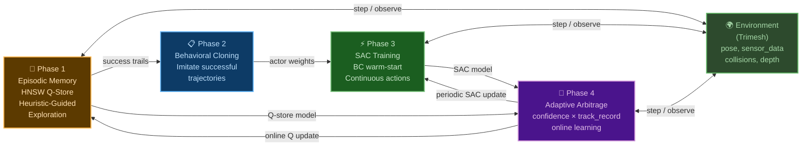
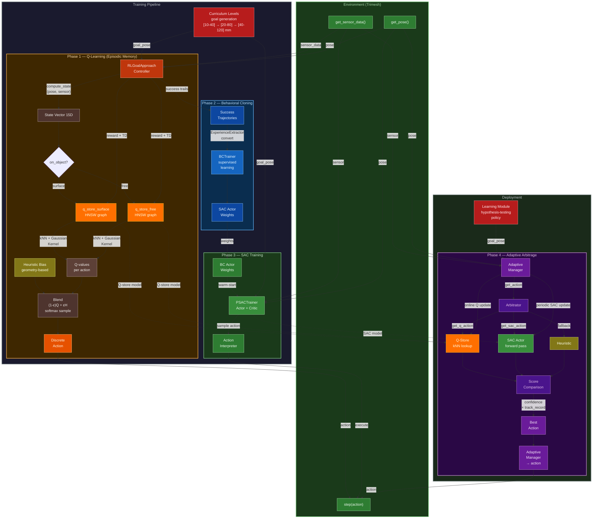

# Summary

## This is a prototype to implement, test and proof ideas below.

Replace the `JumpToGoalState` mixin in Monty's motor system with a model-free reinforcement learning (RL) agent that learns to navigate incrementally toward goal states provided by Learning Modules. Instead of teleporting the sensor to a target pose, the RL agent selects from existing Monty actions to move step-by-step toward the goal, learning from dense reward signals based on distance reduction.

My idea is to take the best practices and bring them closer to how the brain works.
Most similar in a practical sense is a hybrid of solutions:
### Episodic Memory  
- **Situation**: 'I've been in a similar situation before. What did I do then? What happened?'  
- **Algorithm**: HNSW + kNN + Gaussian Kernel Interpolation  
- **When to use**: At the begining of learning, novelty, rare / important events  
- **Characteristics**: One-shot / few-shot learning, Fast activation by similarity, High locality, poor generalization.

### Habits / skills  
- **Situation**: 'I've done this action many times under these conditions — it usually works well.'  
- **Algorithm**: Soft Actor-Critic (SAC) — parametric policy/value  
- **When to use**: During routine, automated actions, stable conditions  
- **Characteristics**: Slow learning over many repetitions, Generalization is highly effective

### Algorithm of arbitration between systems: when to trust memory and when to trust the network  
This is not a separate policy, but a mechanism for switching between behavior modes.

# Motivation

## Current Problem

The hypothesis-testing policy in Monty's Evidence Learning Module generates goal states — target poses where the sensor should move to gather disambiguating evidence about object identity. Currently, these goals are enacted by the `JumpToGoalState` mixin, which teleports the agent instantaneously to the target pose using `SetAgentPose`.
This teleportation approach has fundamental limitations as instantaneous teleportation has no biological or robotic analog. A real agent must navigate through space incrementally with collision awareness.

## Why kernel-based Q-learning with episodic memory (HNSW + kNN + Gaussian Kernel Interpolation)

### Biological Plausibility

The chosen approach (kernel-based Q-learning with episodic memory) has parallels to hippocampal memory systems:

- **Episodic storage**: Individual experiences stored as state-value pairs (analogous to hippocampal episode encoding)
- **One-shot / few-shot learning**: It is enough for a person to do something once in order to act similarly in a similar situation
- **Pattern completion**: KNN retrieval from partial state matches (analogous to hippocampal pattern completion)
- **Kernel generalization**: Smooth interpolation across similar experiences (analogous to memory generalization during retrieval)
- **Non-parametric**: No fixed-size weight matrix; memory grows with experience (analogous to ongoing hippocampal neurogenesis)

This aligns with Monty's broader goal of biologically plausible computation.

### Theoretical publications
- Ormoneit & Sen's (2002) 'Kernel-Based Reinforcement Learning' proposed and analyzed a variant of Q-learning for large state spaces, in which the Q-function is approximated by kernel regression on the data rather than by a neural network or table. A key contribution is the conditions under which such a 'kernel Q-learning' scheme converges.
- Blundell et al. (2016) 'Model-Free Episodic Control'. The agent remembers its past successful actions and returns and, when faced with a similar state, simply reproduces the best of what has already worked.

### HNSW + kNN + Gaussian Kernel Interpolation

Hierarchical Navigable Small World (HNSW) is an approximate nearest neighbor search algorithm based on a layered graph data structure. It belongs to the family of proximity graphs, where nodes (vertices) are connected based on their proximity, typically measured by the Euclidean distance.  
HNSW is currently actively used in embedding databases for searching similar text by vectors. So, I decided to use it to store and find states.  [What is State](#state-vector-15d)  
During the learning process, the agent stores experience in a graph and then uses the weighted past experience in a similar situation. Thehnically it looks like: store point in HNSW graph, then find the K closest ones and mix them with Gaussian kernel weights.
[Realization details here](src/tbp/hybrid_rl/hnsw_state_store.py)

### Why not only Deep Learing
I'm not opposed to deep learning. I agree that it's well suited for approximation, embedding, and many other tasks.  
I'm not suggesting replacing neural networks, I'm suggesting supplementing it and improving the learning process.

## You can read README_v1.md for details and questions before POC was implemented
[LINK](README_v1.md)

# Guide-level explanation
## Architecture Overview

The system has four phases. Training: Q-learning builds episodic memory, then Behavioral Cloning extracts successful trajectories, then SAC learns a parametric policy. Deployment: Adaptive Arbitrage decides per step whether to use Q-store, SAC, or heuristic fallback. All phases interact with the environment. Goals come from curriculum during training, and would come from the Learning Module in production.



Evidence LM's Goal-State Generator proposes the goal-state from the hypothesis-testing policy.
**goal_pose** = [x, y, z, pitch, yaw, roll]  
   ↓  
**RLGoalApproachController** computes **State Vector** using **goal_pose** as well as sensory patch input and proprioceptive information.   
   ↓  
**At the begining for new states** it needs to learn before inference.  
   ↓  
**RL Q-leraning with HNSW + kNN + Gaussian Kernel Interpolation** working with discrete actions. [What is Action](#montyactionspace)    
Actions are selected using [Heuristic-Guided Exploration](#heuristic-guided-exploration) approach. Objective: To obtain smart behavior and training data for SAC.  
HNSW graph points collection (gathering experience). Copying of **successful traces into replay buffer**.
**HNSWStateStore** stores **State Vector**, actions, Q-values.
Upon reaching a certain threshold of successful validation operations moves to next step of learning.    
   ↓  
**Behavioral cloning (BC)** — method of imitation learning in which an agent learns to imitate the behavior of an expert by directly copying his actions based on data. BC is the simplest form of imitation learning: we teach the robot's policy as a supervised learning task—to predict the action of an expert based on observation. It can be used as independent approach but usually used as supplement before SAC or other off-policy RL algorithm.
Translation of HNSW 18D discrete action space from replay buffer into Parameterized SAC continuous action space. Replacing of 8 direction MoveTangentially with one action with two parameters: angle_deg, distance. Others actions are stays the same. Main defference will be during SAC training when paramters can be any value, not fixed config free_step, rotation_step, surface_step.
   ↓  
**Train a SAC Actor policy using supervised learning loss** to have a continuous policy that copying the behavior of a discrete policy.  
   ↓  
**Warm-start to run RL SAC training with Critic policy** as well using the Actor policy weights from the BC.
Train with a reward (progress toward the goal, penalty for collisions) in real or sim environment.
The SAC refines the policy: it makes movements smoother and more accurate, adapting to new scenes.
**Now the policy doesn't just copy of a discrete policy, it optimizes**.  
   ↓  
In future when SAC is trained we use it as **skills to propose continuous actions**  

## Advantages of this scheme:
- Quick start with Q-learning and discrete actions – no need to wait for the SAC to learn from scratch.
- Stability – Heuristic-Guided Exploration learns in new areas.
- Precision – then SAC makes movements smooth and optimal as skills.
- Biologically plausible – like human learning: first we copy, then we hone.


**Below is explanation of the main components**:

## State Vector (15D)
The agent sees a 15-dimensional state vector. Everything is in the agent's local coordinate frame — this is important for generalization, because going from A to B requires the same actions regardless of absolute position in the world.
Three groups of features:

> **Where is the goal?** Position error — 3D direction to goal. Rotation error — how much to turn. Distance — scalar. These tell the agent 'the goal is 30mm ahead and to the left.'
>
> **What surface am I on?** Surface normal, mean curvature, Gaussian curvature, on_object flag. These tell the agent 'I'm on a curved wall' or 'I'm in the air.'
>
> **How is the goal oriented relative to the surface?** Alignment — dot product of goal direction and surface normal. Normalized depth. Alignment is the key feature — when it's negative, the goal is behind the surface, and the agent needs to detach and fly. When it's positive, the agent can crawl along the surface.
>
> The state is action-space independent — it describes the situation, not what actions are available

I started with 13D and expanded to **15D** during testing. The additional features (mean curvature, Gaussian curvature) improved surface navigation.
The state vector is action-space independent — it describes the agent's situation relative to the goal, not the specific actions available.  
| Index | Feature | Description |
|----------|----------|----------|
| 0-2   | position_error [x, y, z]   | direction to goal in agent's local frame   |
| 3-5   | rotation_error [pitch, yaw, roll]   | orientation error (normalized angles)   |
| 6-8   | local_normal   | surface normal in agent's local frame   |
| 9   | mean curvature   | mean curvature   |
| 10   | Gaussian curvature   | Gaussian curvature   |
| 11   | on_object   | whether sensor on object surface   |
| 12   | alignment   | dot(goal_direction, surface_normal)   |
| 13   | distance   | Euclidean distance to goal   |
| 14   | norm_depth   | normalized depth to nearest surface   |


## ActionSpace (25D) - What agent can do
There are 25 discrete actions in four categories.

> "**Surface movement** — 8 directions of MoveTangentially, plus OrientHorizontal and OrientVertical. This is crawling along the object surface.
>
> **Free movement** — MoveForward in three step sizes: normal 8mm, small 2mm, and backward 2mm. This is flying through air.
>
> **Orientation** — TurnLeft, TurnRight, LookUp, LookDown, each in normal and big step sizes. 5 degrees and 15 degrees. Big steps for coarse correction, small for fine-tuning.
>
> **Macro actions** — Detach and DetachEdge. These are multi-step sequences. Detach lifts off the surface along the normal and flies toward the goal. DetachEdge flies up to the edge of the object and over to the other side. These are critical for navigating around obstacles — you'll see them a lot in the demo.
>
> The action space is a configurable parameter. Adding or removing actions doesn't require architectural changes

The current prototype uses discrete actions with fixed step sizes.   
The next step is Parameterized SAC — same action categories but with continuous parameters for distance and angle. This gives the flexibility of continuous control while preserving the interpretability and compatibility with Monty's action primitives.   
I originally planned a purely continuous action space as a third step, but I now believe Parameterized SAC is sufficient — it solves the fixed-step problem while maintaining compatibility with Monty's MoveTangentially, MoveForward, and other action types.   
For real robot deployment, these high-level actions map to inverse kinematics, which is a standard robotics problem.

### How to use action types in RL step by step:
1. Q-learning and discrete actions - 'What to do' (high level primitives with fixed parameters)
The policy outputs an index from 0 to 24.  
Fixed directions, surface_step, free_step, rotation_step are used.  
2. Parameterized SAC (current proposal)  - 'What to do' (high level primitives with continious parameters) 
The policy outputs: action index (0-8) and a continuous parameter instaed of fixed step.
Replacing of 8 direction MoveTangentially with one action with two parameters: angle_deg, distance. Others actions are stays the same.
3. Purely continuous SAC - Skipped, reasons: Loss of interpretability, Difficulty of learning, Loss of domain knowledge, Incompatibility with high level primitives  
The policy outputs a vector [Δx, Δy, Δz, Δθ, Δφ] and then interprets this as a combined motion.
4. Mathematical controller (Low-level / Inverse kinematics & Impedance)
This is 'spinal cord' that receives a command from the neural network (SAC) and instantly calculates the motor actions.

At the beginning I used 18 actions then 2 macro actions and 5 different step / rotation size actions were added:
### Discrete action space 25D
| Index | Action               | Description                                                                 | Mode     | Parameters |
|--------|------------------------|-------------------------------------------------------------------------|-----------|-----------|
| 0–7    | MoveTangentially       | Movement tangent to the surface in 8 directions: 0°, 45°, ..., 315° | surface   | `distance: float`, `direction: VectorXYZ` |
| 8      | MoveForward            | Moving forward (in the direction the agent is looking)              | both       | `distance: float` |
| 9      | MoveForward (neg)      | Moving backward                                                          | both       | `distance: float` |
| 10     | TurnLeft               | Rotate the agent to the left (along the Y axis, yaw)                  | distant   | `rotation_degrees: float` |
| 11     | TurnRight              | Rotate the agent to the right                                            | distant   | `rotation_degrees: float` |
| 12     | LookUp                 | Tilt the agent/sensor up (pitch)                                      | distant   | `rotation_degrees: float` |
| 13     | LookDown               | Tilt the agent/sensor down                                              | distant   | `rotation_degrees: float` |
| 14     | SetSensorRotation (+)  | Rotate the sensor clockwise around the normal (yaw)                          | both       | `rotation_quat: Quaternion` |
| 15     | SetSensorRotation (-)  | Rotate the sensor counterclockwise                                          | both       | `rotation_quat: Quaternion` |
| 16     | OrientHorizontal       | Correction of position and orientation in the horizontal plane (with compensation) | surface   | `rotation_degrees: float`, `left_distance: float`, `forward_distance: float` |
| 17     | OrientVertical         | Correction of position and orientation in the vertical plane                | surface   | `rotation_degrees: float`, `down_distance: float`, `forward_distance: float` |
| 18 | Detach | macro | Detach from surface along normal, then fly toward goal |
| 19 | DetachEdge | macro | Detach from surface along normal, then fly upward to the edge, turn toward goal and fly over to the other side. Used when the goal and agent are on opposite sides of the wall |
| 20 | MoveForward Small | free | MoveForward on small step |
| 21 | LOOK_UP_BIG | orient | look up at big rotation |
| 22 | LOOK_DOWN_BIG | orient | look down at big rotation |
| 23 | TURN_LEFT_BIG | orient | turn left at big rotation |
| 24 | TURN_RIGHT_BIG | orient | turn right at big rotation |

- **Action steps:** Smaller steps reduce collisions but increase episode step length. After many iterartions values were choosen:
   - surface_step: 3.0
   - free_step: 8.0
   - free_step_small: 2.0
   - rotation_step: 5.0
   - rotation_step_big: 15.0
   - free_step_backward: 2.0


## HNSWStateStore
Update state → normalize → KNN search
→ if near existing point: update it
→ else: insert new point with interpolated init

Get state → normalize → KNN search → kernel interpolation → Q-values

> "One important design decision: I split the Q-store into two separate HNSW graphs. **q_store_surface** for when the agent is on the object, and **q_store_free** for when it's in the air. The same position in space requires opposite strategies depending on whether you're touching the surface. On the surface — crawl. In the air — steer and fly. Mixing them in one store confused the learning."


## Reward Function
> "One important design decision — the reward signal is computed entirely locally in the motor system. No involvement from Learning Modules or CMP. The agent gets three types of feedback:
>
> **Progress reward** — proportional to how much closer it got to the goal on each step. This is the main learning signal — dense, available every step, not sparse like 'goal reached' alone.
>
> **Terminal rewards** — a large positive reward for reaching the goal, and penalties for collisions or timeout. Collisions are detected locally through depth and normal changes — if the agent passes through the surface, the episode ends.
>
> **Step penalty** — a small negative reward every step, which encourages the agent to find efficient paths rather than wandering.
>
> The key point is that this is self-contained. The motor system knows the goal pose, it knows its current pose, it can compute distance — that's all it needs. This means the RL module doesn't add any computational burden to the Learning Modules."

| Component | Reward | Done? | When |
|:----------|-------:|:-----:|:-----|
| Progress (per good step) | ~+3.0 | No | Every step; `(prev_dist - dist) / surface_step × 3.0` |
| Goal reached | +60.0 | Yes | `distance < goal_threshold (2mm)` |
| Step penalty | -0.5 | No | Every step |
| Surface violation | -12.0 | Yes | Agent passed through object (depth < 0.5mm or normal flipped) |
| Near goal on surface | +0.5 | No | `distance < 3 × surface_step` AND `on_object = true` |
| Timeout | -12.0 | Yes | `steps >= max_steps_per_goal` |

Details of logic here: def _compute_reward(self, state, prev_state, action, collision):
[LINK](src/tbp/hybrid_rl/rl_goal_approach_controller.py)

## Heuristic-Guided Exploration
> "Before Q-learning has any experience, the agent needs reasonable behavior from step one. That's what heuristics provide. They are geometric rules that bias action selection."

> "**On surface, goal reachable** — the surface_move heuristic projects the goal direction onto the tangent plane and picks the best of 8 crawling directions. Simple geometry, works well on convex surfaces.
>
> **On surface, goal unreachable** — alignment is negative, meaning the goal is behind the surface. The detach heuristic recommends lifting off. If the agent's normal and goal's normal are opposite, it recommends detach_edge to fly over the wall.
>
> **In the air** — the steer heuristic simulates four rotations, picks the one that best aligns the view with the goal direction, and recommends flying forward. Big rotations when far off, small when almost aligned.
>
> **Stuck** — if distance hasn't decreased in 5 steps, the stagnation heuristic overrides surface crawling and recommends detach.
>
> Heuristics provide reasonable behavior from step one, but they alone are not sufficient — Q-learning stores corrections where heuristics were wrong and improves success rate significantly."

> "The action selection formula is simple: Combined score equals (1 minus epsilon) times Q-values plus epsilon times heuristic bias. Then softmax sampling.
>
> At the beginning, epsilon is high — mostly heuristic. As the agent learns, epsilon decays — mostly Q-values. But heuristics never fully disappear — they serve as a safety net.
>
> In adaptive mode, the Arbitrator adds another layer: it compares Q-store confidence with SAC confidence, weighted by each source's track record. The source with the higher score wins. If both scores are zero — heuristic fallback.

#### Problem with Standard ε-Greedy

Standard ε-greedy exploration selects random actions with probability ε. In a 25-action space, a random action has only small chance of being useful (moving toward the goal). This means the most of exploration steps are wasted, resulting in slow learning and poor initial behavior.

#### My Approach: Blending Q-Values with Heuristics

Instead of random exploration, blend learned Q-values with heuristic bias derived geometric reasoning:

```python
combined = (1 - ε) × Q_normalized + ε × heuristic_normalized
action = softmax_sample(combined, temperature=max(0.1, ε))
A small fraction (ε × 10%) of actions remain purely random to guarantee full action space coverage.
```
Transition Schedule

| Phase | Epsilon | Behavior |
|---|-----------|--------|
| Cold start | 1.0 → 0.5 | Nearly pure heuristic — reasonable from step 1 |
| Learning | 0.5 → 0.1 | Blend of Q-values and heuristic |
| inference | 0.1 → 0.05 | Nearly pure Q-values with light heuristic safety net |

###	Possible Heuristic examples that use pure geometry and action space parameters

| # | Heuristic | Description |
|---|-----------|--------|
| 1 | Move toward goal | surface - MoveTangentially, distant - MoveForward |
| 2 | Goal far → fly,  goal close → crawl | surface_crawl vs free |
| 3 | Goal through surface → detach | LookUp |
| 4 | In the air navigating by rot_error | TurnRight, TurnLeft, LookDown, LookUp | 

[Realization details here def _compute_heuristic_bias](src/tbp/hybrid_rl/rl_goal_approach_controller.py)

**Limitation:** Heuristic biases currently reference specific action indices (e.g., `IDX_DETACH`, `IDX_FREE_FORWARD`). For a different action space, heuristics would need to be adapted. This is by design — heuristics encode domain-specific geometric reasoning that depends on what actions are available. A fully action-space independent heuristic system would require a mapping layer between geometric intentions (e.g., "move toward goal") and available actions.


## Lightweight Enviroment
To fast test hypophesys and ideas we need to create relevant approximation of Habitat, especially for training policies based on haptics/active perception.
It should not simulate graphics, but it should accurately reproduces the key physics that are important for training: contact, normals, ray casting, movement on surfaces.
I suggest to use Trimesh python library for loading and using triangular meshes with an emphasis on watertight surfaces. https://github.com/mikedh/trimesh
The Lightweight Environment (Trimesh) proved essential for rapid iteration — each experiment takes ~ 1-2 hours to test on my laptop
[Details are here](src/tbp/hybrid_rl/lightweight_env.py)

### Obejscts
To train / test complete action space we can start with these primitives:
- Cube: trimesh.primitives.Box
- Cylinder: trimesh.creation.cylinder
- Mug, Cup, Vase
[Sizes and realization are](src/tbp/hybrid_rl/mesh_factory.py)
[Pictures are](results_publish/objects)


## Complete Detailed Diagramm



# Main Proof of Concept Results

The prototype has been implemented and tested on the Lightweight Environment (Trimesh-based). Below are the key results that I hope confirm the ideas from the RFC.

## Pipeline Validation
**The full pipeline works end-to-end: Q-learning → Behavioral Cloning → SAC → Arbitrage**

> "Let me show the training results across objects. I trained Q-learning sequentially — cube first, then cylinder, mug, cup — each stage building on the previous Q-store."
| Stage | Object | Train Success Rate | Eval Success Rate |
|-------|--------|--------------------|-------------------|
| Q-learning | cube | 58% | 73% |
| Q-learning | cylinder | 53% | 67% |
| Q-learning | mug | 47% | 46% |
| Q-learning | cup | 51% | 48% |

> "A few things to note. First, **transfer works** — each new object starts from the previous Q-store, not from scratch. Cylinder benefits from cube experience, mug from both. Second, **eval is higher than train for simple objects** — cube 73% vs 58%, cylinder 53% vs 67%  — because during training epsilon is high and the agent explores, while during eval it exploits learned Q-values. Third, **complex objects are harder** — mug and cup have handles, concavities, thin walls. The agent is more accurate but sometimes runs out of steps — it crawls carefully but slowly. Similar results for mug and cup show that the agent has learned and is working on new target-agent pairs on validation stage."

> "SAC results are below Q-learning, and I want to be transparent about this."
| Stage | Object | Train Success Rate | Eval Success Rate |
|-------|--------|--------------------|-------------------|
| SAC | cube | 46% | 14% |
| SAC | cylinder | 68% | 29% |
| SAC | mug | 47% | 16% |
| SAC | cup | 51% |  |

> "The main issue is high timeout rate — SAC inherited the careful crawling strategy from Behavioral Cloning, and with a 300-step limit it often doesn't reach the goal in time. Q-learning had 500 steps. Also, SAC may need more training episodes and hyperparameter tuning. This is my main area for improvement.
>
> However, SAC adds value in the adaptive mode — it provides strategic decisions like when to detach, and it generalizes to unfamiliar states."

> "The adaptive mode on the vase — a completely new object — shows the hybrid approach working. The vase was never seen during training — Q-store and SAC were trained only on cube, cylinder, mug, and cup. In adaptive mode, Q-store updates every step, SAC gets a small update every 500 episodes. "
| Episode | Q-store weight | SAC weight | Total success rate | Curriculum level |
|---------|---------------|------------|-------------------|-----------------|
| 100 | 29% | 71% | 72% | 0 → 1 |
| 1000 | 32% | 68% | 51% | 2 |
| 1500 | 45% | 55% | 54% | 2 |
| 2000 | 55% | 45% | 55% | 2 |

> "Two trends here. First, **Q-store weight increases over time** — from 29% to 55%. At the beginning SAC is more confident because neural networks always output high-confidence predictions. But as Q-store accumulates vase-specific experience and the track record shows Q-store succeeding more often, the arbitrator shifts weight toward Q-store.
>
> Second, **success rate on level 2 is 55%** — this is the hardest level, 40 to 120mm distance. For comparison, Q-learning eval on known objects at this level is 46-48% for mug and cup. So the adaptive mode on a new object performs comparably to trained models on known objects. And as you saw in the demo Q-learinig and SAC works together quite efficiently during episodes."


> "Let me show you what's behind these numbers — how the agent actually behaves on specific episodes, and how it improves over time. I'll show 4 episodes (100, 400, 600, 1300, 1900) that illustrate how it works under hood."
[You can find detail results with visualizations here](results_publish/adaptive_logs_vase)


> "So the demo explains the numbers. 55% on level 2 reflects a mix of clean successes like episodes 600, 1900, and failures caused by timeouts, collitions or the detach_edge bug I showed in episode 1300. Fixing that bug should push the success rate higher."

### Key Findings

**1. Episodic Memory (HNSW State Store) works as proposed.** One-shot/few-shot learning through Q-update is effective. Update hit rate 0.8–0.95 confirms that kNN + Gaussian Kernel interpolation correctly finds and updates similar states. The store grows organically — dense where the agent visits often, sparse where it rarely goes.

**2. Heuristic-Guided Exploration significantly outperforms ε-greedy.** This confirms the hypothesis from the RFC. Pure geometric heuristics (move toward goal, detach when stuck, steer in air) provide reasonable behavior from step 1, and Q-values gradually take over as experience accumulates.

**3. Q-learning improves with experience**  Learning begins working from step 1 and improves success rate even transfering to more complex levels. On training more collitions rate and less timeouts. On validation vice versa. Agent became more accurate but sometimes goes out of step limit per episode. Agent crawls mostly and discrtete actions needs more steps to achieve the target.

**4. SAC results less than Q-learning** It needs more investigation, reason is high timeout rate.
- SAC steps per episode limit (300) was less than Q-learning (500) as continues actions should be more flexible
- SAC inherited accurate crawl strategy from Q-learning and it was not enough episodes to study more optimal one
- Hyperparameters and implementation should be checked one more time

**5. Adaptive arbitrage between episodic memory and skills works.** On the new object vase adaptive arbitrage shows 55% success rate. This is more than independent Q and SAC rates on validation phase for known objects. First, more SAC was choosen, then Q-learinig. Because SAC, as a neural network, is always more confident, but then success statistics help Q-learinig to increase q_store_rate. 
Agent mostly crawled (move_tangentially action takes more than 50%), but all other actions (orient, free_move, macro categories) are also used in less proportion in proper situations.
Failures were mostly due to collisions, then timeout (out of step limit per episode).


### Training and validation strategy details
#### Use several oblects from simple to complex: cube, cylinder, mug, cup, vase
[Sizes and realization are](src/tbp/hybrid_rl/mesh_factory.py)
[Pictures are](results_publish/objects)

#### Training and validation stages
- I used the standard Monty approach with [Hynda YAML](src/tbp/hybrid_rl/conf/experiment/rl_goal_approach.yaml) and [experiment.py](src/tbp/hybrid_rl/experiment.py)
You can reproduce the results by yourself. Example of VSCode settings.json below
```
"configurations": [
   {
      "name": "RL Goal Approach — Config",
      "type": "debugpy",
      "request": "launch",
      "program": "${workspaceFolder}/run.py",
      "args": [
            "--config-dir", "${workspaceFolder}/src/tbp/hybrid_rl/conf",
            "experiment=rl_goal_approach",
      ],
      "cwd": "${workspaceFolder}",
      "env": {
            "MONTY_LOGS": "${workspaceFolder}/results",
            "MONTY_MODELS": "${workspaceFolder}/results/pretrained_models",
            "MONTY_DATA": "${workspaceFolder}/data"
      },
      "console": "integratedTerminal",
      "justMyCode": false
   }, 
]
```
- I used curriculum_levels approach from simple to complex tasks depends on distnace between goal and agent:
      - [10.0, 40.0] # use additional check that agent and goal were on the same side of object
      - [20.0, 80.0]
      - [40.0, 120.0]
   - promote_threshold: 0.6
   - promote_window: 100

- Stages
1) Q-learning - train and validate cube, cylinder, mug, cup
    - training_stages:
      - mesh: cube
        episodes: 2000
        epsilon_start: 1.0
        epsilon_min: 0.10
        load_mode: null # Start from scrtach
      - mesh: cylinder
        episodes: 3000
        epsilon_start: 1.0
        epsilon_min: 0.10
        load_mode: auto # use and update previous Q-store
      - mesh: mug
        episodes: 7000
        epsilon_start: 1.0
        epsilon_min: 0.10
        load_mode: auto # use and update previous Q-store
      - mesh: cup
        episodes: 7000
        epsilon_start: 1.0
        epsilon_min: 0.10
        load_mode: auto # use and update previous Q-store

    - eval_meshes: [cube, cylinder, mug, cup]
    - eval_episodes_per_level: 500   
    
[You can find details results here](results_publish/Q-learn)

- rl_config:
      mode: train_adapt_epsilon
      goal_threshold: 4.0
      max_points: 500000
      k_neighbors: 7
      max_steps_per_goal: 500
      adaptive_sigma: true
      insert_threshold: 0.50
      auto_calibrate: false
      reward_goal_reached: 60.0
      reward_timeout: -12.0
      reward_surface_violation: -12.0
      reward_step_penalty: -0.5
      surface_step: 3.0
      free_step: 8.0
      free_step_small: 2.0
      rotation_step: 5.0
      num_actions: 25
      rotation_step_big: 15.0
      free_step_backward: 2.0


2) Collect success trails from Q-learing validation and train Behavioral Cloning (SAC Actor)   
[You can find details results here](results_publish/BC-train)

3) Train and validate SAC using BC knowledge (BC warm-start)
    - sac_meshes: [cube, cylinder, mug, cup]
    - sac_episodes_per_mesh:
      cube: 1000
      cylinder: 1500
      mug: 3000
      cup: 2000
    - sac_eval_episodes_per_level: 500
    - sac_config:
      load_mode: null
      goal_threshold: 4.0
      gamma: 0.99
      tau: 0.005
      lr_actor: 0.00001
      lr_critic: 0.0003
      batch_size: 256
      buffer_capacity: 500000
      bc_lambda_init: 5.0
      bc_lambda_decay: 0.999999
      max_steps_per_goal: 300
      eval_interval: 200
      eval_episodes: 100

      [You can find details results here](results_publish/SAC)

4) Run adaptive mode with arbitrage and online learning for vase using Q and SAC knowledge from cube, cylinder, mug, cup

Let's describe in more detail adaptive arbitrage mode as it's the one of key feature of the hybrid approach.  
- Adaptive arbitrage decides which action source to use per step. [Full realization here](src/tbp/hybrid_rl/arbitrator.py)  
Switches between Q-store (episodic memory), SAC (skill), and heuristic (fallback).
Main function is def decide(self, state, current_pose, sensor_data):
Choose action source based on performance. Uses confidence × track_record scoring. 
When insufficient track record data, uses neutral prior (0.5) to let confidence decide. 
Heuristic is fallback only when both Q-store and SAC have zero score.
- Adaptive arbitrage continiously learning. [Full realization here](src/tbp/hybrid_rl/adaptive_manager.py)  
   - online: Q-store updates every step, SAC updates periodically. Default mode — always learning.
   - inference_only: no updates. Only when consistently high success rate — system has mastered the object.
   - offline: full retraining. Only when both sources fail for extended period — emergency mode.

- YAML config for testing
   - adaptive_mesh: vase
   - adaptive_episodes: 2000
   [You can find detail results with visualizations here](results_publish/adaptive_logs_vase)
   At the beginning the agent used not efficient strategy on new object (timeout, collisions). Then agent learnt object specific and last episodes it moves almast perfectly.


### Resuls summary for Q and SAC train and validation

| Stage | Method | Success Rate (avg for levels) | Object |
|-------|--------|-------------|--------|
| Q-learning (episodic memory) - Train | HNSW + kNN + Heuristic | 58% | cube |
| Q-learning (episodic memory) - Train | HNSW + kNN + Heuristic | 53% | cylinder |
| Q-learning (episodic memory) - Train | HNSW + kNN + Heuristic | 47% | mug |
| Q-learning (episodic memory) - Train | HNSW + kNN + Heuristic | 51% | cup |
| Q-learning (episodic memory) - Eval | HNSW + kNN + Heuristic | 73% | cube |
| Q-learning (episodic memory) - Eval | HNSW + kNN + Heuristic | 67% | cylinder |
| Q-learning (episodic memory) - Eval | HNSW + kNN + Heuristic | 46% | mug |
| Q-learning (episodic memory) - Eval | HNSW + kNN + Heuristic | 48% | cup |
| SAC (skill, softmax policy) - Train | BC warm-start → SAC | 46% | cube |
| SAC (skill, softmax policy) - Train | BC warm-start → SAC | 68% | cylinder |
| SAC (skill, softmax policy) - Train | BC warm-start → SAC | 41% | mug |
| SAC (skill, softmax policy) - Train | BC warm-start → SAC | 33% | cup |
| SAC (skill, softmax policy) - Eval | BC warm-start → SAC | 14% | cube |
| SAC (skill, softmax policy) - Eval | BC warm-start → SAC | 29% | cylinder |
| SAC (skill, softmax policy) - Eval | BC warm-start → SAC | 16% | mug |


### Resuls summary for adaptive arbitrage mode
| episode | q_store_weight_rate | sac_weight_rate | action_agreement_rate | q_success_rate | sac_success_rate | total_episodes_success_rate | curriculum level |
|-------|-------|--------|-------------|--------|--------|--------|--------|
| 100 | 29% | 71% | 77% | 84% | 61% | 72% | 0 -> 1 |
| 1000 | 32% | 68% | 76% | 52% | 48% | 51% | 2 |
| 1500 | 45% | 55% | 76% | 67% | 30% | 54% | 2 |
| 2000 | 55% | 45% | 75% | 63% | 20% | 55% | 2 |


# Next Steps
## Integration path with Monty
> "There's an interesting design choice here. JumpToGoal teleports and gives the LM one observation at the target point. With RL navigation, the agent physically moves through space and passes over the object surface on the way to the goal. Every intermediate point contains pose and features that the LM could use for evidence accumulation.
> I'd like to implement this as a configurable option."
### In the default mode, intermediate steps are motor-only — same contract as JumpToGoal, easy to validate. 
### Second mode where the LM processes observations during navigation. 
This turns goal-directed movement into directed exploration — not random, but biased toward the discriminative point that the GSG selected. The object might be recognized before the agent even reaches the goal.
>
> This aligns with the emphasis on sensorimotor learning — every movement is an opportunity to gather information. And it's something that teleportation fundamentally cannot do."


### The default mode (JumpToGoal replacement) integration path
- RLGoalPolicy as a drop-in replacement for JumpToGoal
> "The most natural first step is to create an RLGoalPolicy that implements the MotorPolicy protocol — same `__call__` signature, same `reset`, same `state_dict`. It receives the Goal from the GSG exactly as JumpToGoal does — `goal.location` and `goal.morphological_features['pose_vectors']` — and navigates there incrementally instead of teleporting with SetAgentPose.

- RLPolicySelector
> "For the selector, I'd create an RLPolicySelector similar to DistantPolicySelector. It routes GSG goals — `sender_type == 'GSG'` — to the RLGoalPolicy, SM goals to LookAtGoal, and falls back to the default exploration policy when no goal is active. This means all existing Monty behavior is preserved — the curvature-following surface policy, the random walk distant policy, voting, everything works exactly as before. The RL module only activates when the hypothesis-testing policy generates a goal state."

- State computation from CMP
> "The state vector for the RL controller maps directly from what Monty already provides. The percept message contains surface normal, principal curvatures, on_object flag, depth — these are exactly the features I use in my 15D state vector. The goal pose comes from the Goal object. Current pose comes from MotorSystemState. No new sensor data is needed — everything is already available through CMP."

- ActionSpace (adapt to Monty actions)

- Validation
> "For validation, we can start with the YCB objects. The key metric would be: does replacing JumpToGoal with RLGoalPolicy maintain classification accuracy and pose estimation quality, while using only incremental actions?"


---
# Future possibilities
> "Beyond replacing teleportation, this opens up several things as future work.
>
> **Real robot deployment.** The RL policy provides this capability. The high-level actions — move forward, turn, crawl along surface — map to standard robot primitives, and inverse kinematics handles the low-level joint control.
>
> **Model-based planning.** The HNSW Q-store is designed as a single integration point — both model-free updates from real experience and model-based updates from simulated planning can write to the same store. Monty's learned reference frames could serve as the world model — the LM already knows the 3D structure of objects, which could be used to simulate the consequences of actions before executing them.
>
> **Multi-LM coordination.** When multiple LMs generate competing goal states, the current system picks the highest confidence. With RL navigation, the motor system could also consider reachability — a closer goal might be preferred over a more discriminative but harder-to-reach one."

