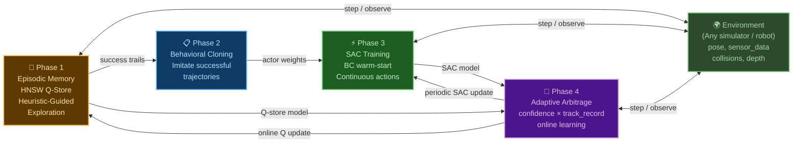

# Bio-Inspired Hybrid RL for Object Navigation

## Abstract

We present a hybrid reinforcement learning system for goal-directed navigation on 3D object surfaces. The system combines three complementary learning mechanisms — **episodic memory** (kernel-based Q-learning with HNSW nearest-neighbor search), **learned skills** (Soft Actor-Critic with continuous actions), and **geometric heuristics** (hand-crafted domain knowledge) — unified by an **adaptive arbitrator** that selects the best action source per step based on confidence and track record.

The architecture is inspired by biological memory systems: episodic memory provides one-shot learning and fast adaptation (hippocampal analogy), parametric policy captures generalized skills through repetition (procedural memory analogy), and the arbitrator implements a metacognitive switching mechanism between behavior modes.

We validate the approach on a lightweight trimesh simulator across 9 object geometries, demonstrate sim-to-sim transfer to MuJoCo with real YCB objects (no retraining), and present a case study integrating the system with the Thousand Brains Project's Monty framework for object recognition. Key results: **91% average navigation success** across all difficulty levels, **83% on unseen objects** (zero-shot generalization), and **99% on convex YCB objects** in MuJoCo without fine-tuning.

---

## 1. Introduction

### The Problem

Many robotic and cognitive systems require an agent to navigate along 3D object surfaces toward specific goal locations. In object recognition, a perception system may identify a discriminating point on an object — "observe the surface *here* to distinguish a mug from a cup" — and the motor system must navigate the sensor to that point. In robotic manipulation, a gripper must traverse an object's surface to reach a grasp point. In haptic exploration, a tactile sensor must systematically cover an object's geometry.

The standard approach in simulation is **teleportation**: instantly move the agent to the target pose. This is computationally convenient but has no biological or robotic analog. A real agent must navigate incrementally through space, maintaining surface contact, avoiding collisions, traversing edges, and handling the geometric complexity of real objects.

Replacing teleportation with realistic navigation introduces fundamental challenges:

- **Surface geometry is complex.** Objects have edges, rims, concavities, and thin walls. An agent must crawl along curved surfaces, detect and traverse edges, detach from surfaces when necessary, fly through air, and land on target surfaces — all without a map.

- **Goals may be unreachable by direct paths.** When the goal is on the opposite side of an object, the agent must plan a multi-phase trajectory: crawl to an edge, detach, fly around, and land. No single behavior suffices.

- **Learning must be fast.** A robot encountering a new object cannot afford thousands of failed episodes before achieving basic navigation. The system needs one-shot or few-shot adaptation.

- **The system must be robust.** In deployment, the agent faces sensor noise, imprecise actuation, and objects never seen during training. Graceful degradation and online adaptation are essential.

### Our Approach

We propose a hybrid RL system that mirrors how biological agents learn motor skills:

1. **Episodic memory first.** Like a child learning to navigate, the system starts by remembering specific experiences: "In *this* situation, *this* action worked." A kernel-based Q-learning algorithm with HNSW nearest-neighbor storage provides one-shot learning and fast retrieval. This is analogous to hippocampal episodic encoding.

2. **Skills through repetition.** Successful episodic experiences are distilled into a parametric policy (SAC) via behavioral cloning, then refined through reinforcement learning. This is analogous to the transition from declarative to procedural memory — from "I remember turning left here" to "I automatically turn left in situations like this."

3. **Adaptive arbitration.** A metacognitive layer decides per step whether to trust episodic memory, learned skills, or geometric heuristics, based on confidence estimates and rolling track records. This is analogous to the brain's ability to switch between habitual and deliberate behavior depending on familiarity and stakes.

4. **Environment-agnostic design.** The state representation uses only relative geometric features (direction to goal, surface normal, curvatures) in the agent's local frame. This enables policies trained in one simulator to transfer to another — or to a real robot — without retraining.

### Contributions

- A **hybrid RL architecture** combining episodic memory (HNSW Q-store), parametric policy (SAC), and geometric heuristics with adaptive arbitration
- A **frame-invariant 22D state representation** that enables zero-shot sim-to-sim transfer
- A **phase-driven navigation system** with six behavioral phases and strategic/tactical decision hierarchy
- **Experimental validation** on 9 geometric primitives, 5 YCB objects, and integration with the Thousand Brains Project's Monty recognition system
- **Open-source implementation** with modular environment protocol enabling deployment on any simulator or robot

---

## 2. Biological Motivation

### Memory Systems in the Brain

The architecture draws explicit parallels to three biological memory systems:

| Brain System | Function | Algorithm Analog |
|-------------|----------|-----------------|
| **Hippocampal episodic memory** | Store and retrieve specific experiences by similarity | HNSW + kNN + Gaussian kernel Q-learning |
| **Basal ganglia / procedural memory** | Automated skills learned through repetition | Soft Actor-Critic (SAC) parametric policy |
| **Prefrontal arbitration** | Switch between habitual and deliberate behavior | Adaptive arbitrator with confidence × track record |

### Why Episodic Memory Matters for RL

Standard deep RL learns slowly — thousands of episodes to converge. Biological agents learn from single experiences. The episodic memory component provides:

- **One-shot / few-shot learning**: A single successful navigation is stored and can be retrieved when a similar situation arises
- **Pattern completion**: kNN retrieval from partial state matches (analogous to hippocampal pattern completion)
- **Kernel generalization**: Smooth interpolation across similar experiences via Gaussian kernels
- **Non-parametric growth**: Memory grows with experience, no fixed capacity (analogous to ongoing hippocampal neurogenesis)

### Theoretical Foundations

- **Ormoneit & Sen (2002)**, *Kernel-Based Reinforcement Learning*: Proposed and analyzed Q-learning with kernel regression approximation for large state spaces, establishing convergence conditions for non-parametric Q-function approximation.
- **Blundell et al. (2016)**, *Model-Free Episodic Control*: Demonstrated that agents remembering past successful actions and reproducing them in similar states can match or exceed deep RL performance with orders of magnitude fewer samples.

### The Learning Progression

The system follows a biologically plausible learning progression:

```
Phase 1: Episodic Memory (hippocampal)
  "I've been in a similar situation before. What did I do? What happened?"
  → HNSW Q-store with heuristic-guided exploration
  → One-shot learning, high locality, poor generalization

Phase 2: Behavioral Cloning (imitation)
  "Let me practice what worked before."
  → Extract successful trajectories → supervised learning
  → Bridge from discrete episodic to continuous parametric

Phase 3: Skill Refinement (procedural)
  "I've done this many times — I can do it smoothly now."
  → SAC with BC warm-start → continuous optimization
  → Slow learning, high generalization

Phase 4: Adaptive Deployment (prefrontal)
  "Which strategy should I use right now?"
  → Arbitrator: confidence × track_record → best source per step
  → Online learning continues in all systems
```

---

## 3. Architecture

### Overview


```mermaid
flowchart LR
    ENV["🌍 Environment\n(Any simulator / robot)\npose, sensor_data\ncollisions, depth"]

    A["🧠 Phase 1\nEpisodic Memory\nHNSW Q-Store\nHeuristic-Guided\nExploration"]
    B["📋 Phase 2\nBehavioral Cloning\nImitate successful\ntrajectories"]
    C["⚡ Phase 3\nSAC Training\nBC warm-start\nContinuous actions"]
    D["🎯 Phase 4\nAdaptive Arbitrage\nconfidence × track_record\nonline learning"]

    A <-->|"step / observe"| ENV
    C <-->|"step / observe"| ENV
    D <-->|"step / observe"| ENV

    A -->|"success trails"| B
    B -->|"actor weights"| C
    A -->|"Q-store model"| D
    C -->|"SAC model"| D

    D -->|"online Q update"| A
    D -->|"periodic SAC update"| C

    style ENV fill:#2d4a2d,stroke:#66bb6a,stroke-width:2px,color:#a5d6a7
    style A fill:#5c3a00,stroke:#ffb74d,stroke-width:2px,color:#ffe0b2
    style B fill:#0d3b66,stroke:#64b5f6,stroke-width:2px,color:#bbdefb
    style C fill:#1b5e20,stroke:#81c784,stroke-width:2px,color:#c8e6c9
    style D fill:#4a148c,stroke:#ce93d8,stroke-width:2px,color:#e1bee7
```

### Environment Protocol

The system defines a minimal environment interface that any simulator or robot must implement:

```python
class RLEnvironment(Protocol):
    def reset() -> sensor_data
    def get_pose() -> [x, y, z, rx, ry, rz]       # any consistent frame
    def get_sensor_data() -> {normal, depth, curvatures, on_object, ...}
    def set_goal(goal_pose)
    def get_random_surface_point() -> goal_pose
    def step_discrete(action_idx) -> sensor_data    # for Q-store / heuristic
    def step_continuous(type, params) -> sensor_data # for SAC
```

Currently implemented:
- **LightweightEnv** (trimesh) — fast geometric simulation, used for training
- **MuJoCoEnvAdapter** — physics-based simulation, used for evaluation and online adaptation

Future environments (Habitat, real robot) only need to implement this protocol.

---

## 4. State Representation (22D)

The agent observes a 22-dimensional state vector computed entirely in the **agent's local coordinate frame**. This frame-invariance is critical: navigating from A to B requires the same actions regardless of absolute position in the world, enabling zero-shot transfer across environments.

### Five Feature Groups

**Where is the goal?** Position error (3D direction), rotation error (3D), scalar distance. These tell the agent "the goal is 30mm ahead and to the left."

**What surface am I on?** Surface normal (3D), principal curvatures (k1, k2), on_object flag, normalized depth. These tell the agent "I'm on a curved wall" or "I'm in the air."

**How is the goal oriented relative to the surface?** Alignment — dot product of goal direction and surface normal. Negative means the goal is behind the surface (agent needs to detach). Positive means the agent can crawl along the surface.

**Goal surface context.** Goal normal in agent's local frame, path_blocked flag, movement efficiency (net displacement / total movement — detects oscillation).

**Projected goal direction.** 2D projection of goal direction onto the tangent plane (on surface) or agent XY plane (in air). Direct signal for which direction to move.

### Full State Vector

| Index | Feature | Description |
|-------|---------|-------------|
| 0–2 | position_error [x, y, z] | Direction to goal in agent's local frame |
| 3–5 | rotation_error [pitch, yaw, roll] | Orientation error (normalized angles) |
| 6–8 | local_normal | Surface normal in agent's local frame |
| 9 | k1 | Principal curvature (max absolute) |
| 10 | k2 | Principal curvature (min absolute) |
| 11 | on_object | Whether sensor is on object surface |
| 12 | alignment | dot(goal_direction, surface_normal) |
| 13 | distance | Euclidean distance to goal |
| 14 | norm_depth | Normalized depth to nearest surface |
| 15–17 | goal_normal_local | Goal surface normal in agent's local frame |
| 18 | path_blocked | Whether direct path to goal is blocked (0/1) |
| 19 | movement_efficiency | Net displacement / total movement (0..1) |
| 20–21 | projected_goal_2d | Goal direction projected onto tangent plane |

### Strategic State Vectors

In addition to the 22D tactical state, the system uses two compact 5D strategic state vectors for high-level phase transition decisions. These are stored in separate HNSW graphs and control behavioral mode switching rather than individual actions.

**Detach Decision State (5D)** — Should the agent stay on surface or lift off?

| Index | Feature | Description |
|-------|---------|-------------|
| 0 | normal_agreement | dot(agent_normal, goal_normal) — same side? |
| 1 | alignment | dot(goal_direction, agent_normal) — reachable by crawling? |
| 2 | norm_distance | distance / object_extent — relative distance |
| 3 | path_blocked | Direct path blocked? (0/1) |
| 4 | movement_efficiency | Recent crawl efficiency — detects stagnation |

**Direction Decision State (5D)** — In air: fly directly to goal or bypass obstacle?

| Index | Feature | Description |
|-------|---------|-------------|
| 0 | lateral_deviation | How far off-axis the goal is (0=ahead, 1=side) |
| 1 | alignment | dot(goal_direction, agent_normal) |
| 2 | norm_distance | distance / object_extent |
| 3 | angle_to_goal | dot(forward, goal_direction) |
| 4 | path_blocked | Direct path blocked? (0/1) |

> The strategic states are intentionally compact (5D vs 22D). High-level decisions like "should I detach?" depend on a few geometric relationships, not fine-grained curvature. Compact states mean faster learning with fewer samples and better generalization across objects.

---

## 5. Action Space (24D)

The agent selects from 24 discrete actions in four categories:

### Surface Movement
| Index | Action | Description |
|-------|--------|-------------|
| 0–7 | MoveTangentially (8 directions) | Crawl along surface: 0°, 45°, ..., 315° |
| 16 | OrientHorizontal | Position/orientation correction in horizontal plane |
| 17 | OrientVertical | Position/orientation correction in vertical plane |

### Free Movement
| Index | Action | Description |
|-------|--------|-------------|
| 8 | MoveForward | Fly forward (8mm) |
| 9 | MoveForward (backward) | Fly backward (2mm) |
| 19 | MoveForward (small) | Fly forward small step (2mm) |

### Orientation
| Index | Action | Description |
|-------|--------|-------------|
| 10–11 | TurnLeft / TurnRight | Yaw rotation (5°) |
| 12–13 | LookUp / LookDown | Pitch rotation (5°) |
| 14–15 | SetSensorRotation ±  | Roll rotation |
| 20–23 | Big rotations (up/down/left/right) | Coarse correction (15°) |

### Macro Actions
| Index | Action | Description |
|-------|--------|-------------|
| 18 | Detach | Lift off surface along normal, orient toward goal |

### Action Space Progression

The system uses actions at two levels of abstraction:

1. **Q-learning (discrete)**: Policy outputs index 0–23 with fixed step parameters. "What to do" at the primitive level.
2. **SAC (continuous parameters)**: Policy outputs action type + continuous parameters. The 8 tangential directions collapse into one action with continuous angle and distance. "What to do, and exactly how much."

This progression mirrors biological motor learning: first discrete choices ("turn left"), then continuous refinement ("turn 23° at 15mm/s").

---

## 6. Episodic Memory: HNSW Q-Store

### Architecture

The Q-function is approximated non-parametrically using Hierarchical Navigable Small World (HNSW) graphs — the same data structure used in vector databases for embedding similarity search. Each point in the graph stores a state vector, Q-values for all actions, and visit statistics.

**Query**: Given a new state, find K nearest neighbors in the HNSW graph, compute Gaussian kernel weights based on distance, and return weighted Q-values.

**Update**: After observing a reward, update the Q-values of nearby points (or insert a new point if the state is sufficiently novel).

### Four Separate Q-Stores

The Q-store is split into four separate HNSW graphs:

| Store | State Dim | Actions | Purpose |
|-------|:---------:|:-------:|---------|
| **q_store_surface** | 22D | 24 | Tactical actions when on object surface |
| **q_store_free** | 22D | 24 | Tactical actions when in air |
| **strategic_detach** | 5D | 2 | High-level: stay on surface or detach? |
| **strategic_direction** | 5D | 2 | High-level: fly to goal or bypass? |

> The same position in space requires opposite strategies depending on whether you're touching the surface. On the surface — crawl. In the air — steer and fly. Mixing them in one store confused the learning. Similarly, strategic decisions operate on different features and timescales than tactical action selection.

### Key Design Features

- **Feature weights**: Per-store configurable weights that boost strategic features in the HNSW distance computation
- **Normalization freeze**: Running statistics computed during warmup, then frozen. HNSW index rebuilt with final normalization to prevent drift
- **Auto-calibrated insert threshold**: Adapts point density to actual state space coverage
- **Confidence estimation**: Returns proximity, experience, and consistency scores alongside Q-values — used by the arbitrator to gauge trust

---

## 7. Phase-Driven Navigation

### Six Behavioral Phases

The agent operates in one of six phases, determined by geometric analysis of the current situation:

| Phase | Condition | Behavior |
|-------|-----------|----------|
| **CRAWL_TO_GOAL** | On surface, same side, path clear | Crawl along surface toward goal |
| **CRAWL_TO_EDGE** | On surface, different side or blocked, making progress | Crawl toward nearest edge/rim |
| **DETACH_NEEDED** | On surface, different side or blocked, stuck | Lift off surface |
| **FLY_TO_GOAL** | In air, path clear | Steer and fly directly toward goal |
| **FLY_TO_EDGE** | In air, path blocked | Orbit/bypass around object |
| **LAND** | In air, close to goal | Careful approach with small steps |

Phase transitions include **hysteresis** — when conditions change, the agent continues the current phase for several steps before switching, preventing oscillation.

### Two-Level Decision Architecture

**Strategic level** — decides phase transitions using dedicated 5D Q-stores:
- Detach decision: Should the agent stay on surface or lift off?
- Direction decision: In air, fly directly or bypass?
- Updated retrospectively based on episode outcomes

**Tactical level** — selects specific action within the current phase:
- Uses 22D Q-store (surface or free, depending on context)
- Blended with phase-specific heuristic bias

### Heuristic Components

Seven independent heuristic components produce score vectors over all actions:

| # | Component | Description |
|---|-----------|-------------|
| 0 | **Suppress** | Block inappropriate actions (detach in air, sensor rotations) |
| 1 | **Surface move** | Phase-aware tangential direction: geodesic toward goal, or toward edge |
| 2 | **Stagnation** | If stuck: penalize current direction, boost perpendicular |
| 3 | **Steer in air** | Simulate rotations, pick best alignment with target |
| 4 | **Damp free on surface** | Suppress dangerous free movement while on surface |
| 5 | **Flyby correction** | Detect flying past goal, suppress forward, boost correction |
| 6 | **Orientation cooldown** | Penalize repeated ineffective orientation actions |
| 7 | **Landing** | Near goal: small steps only. Emergency depth: suppress large moves |

---

## 8. Reward Function

The reward signal is computed locally using only the agent's pose, sensor data, and goal. It is **phase-aware** — the same physical event gets different rewards depending on the navigation phase.

### Reward Components

| Component | Reward | Terminal? | Condition |
|-----------|-------:|:---------:|-----------|
| **Progress** | ~±3.0 | No | Distance reduction, scaled by phase |
| **Subgoal shaping** | ±3.0 | No | Potential-based (Ng et al. 1999), encourages edge approach when goal is behind surface |
| **Goal reached** | +60.0 | Yes | distance < 4mm |
| **Step penalty** | −0.5 | No | Every step — encourages efficiency |
| **Stagnation** | −0.3 | No | movement_efficiency < 0.1 on surface |
| **Surface violation** | −12.0 | Yes | Agent passed through object |
| **Collision** | −12.0 | Yes | Collision during detach |
| **Timeout** | −12.0 | Yes | Steps exceeded budget |
| **Near goal bonus** | +0.5 | No | Close to goal and on surface |
| **Successful landing** | up to +8.0 | No | Air → surface without collision, scales with quality |
| **Correct crawl** | +0.2 | No | On surface, making progress toward goal |
| **Fly alignment** | ±2.0 | No | Improving/worsening alignment with target in air |
| **Risky free on surface** | −2.0 | No | Free movement while on surface (collision risk) |
| **Flying too far** | −2.0 | No | Distance > 1.5× object extent |
| **Detach in air** | −5.0 | No | Detach action when already airborne |

### Phase-Aware Progress

The progress reward adapts to the current navigation phase:
- **CRAWL_TO_GOAL / FLY_TO_GOAL**: Full progress reward
- **FLY_TO_EDGE**: Negative progress scaled to 20% — moving away from goal while bypassing is expected
- **CRAWL_TO_EDGE / DETACH_NEEDED**: Progress scaled to 10%

---

## 9. Behavioral Cloning & SAC

### Behavioral Cloning: Bridge from Episodic to Parametric

Successful trajectories from Q-learning are extracted and used to train the SAC actor network via supervised learning. This serves as a bridge between the discrete episodic policy and the continuous parametric policy.

Key transformation: The 8 discrete tangential directions (indices 0–7) are collapsed into a single continuous action with two parameters (angle, distance). Other actions retain their type but gain continuous step parameters.

### SAC Training: Skill Refinement

The SAC actor, warm-started from behavioral cloning weights, is refined through standard SAC training with the reward function described above. The BC warm-start is critical — it provides a reasonable initial policy that SAC refines, rather than learning from scratch.

### BC Data Balancing

Training data is balanced across objects and difficulty levels:

```yaml
bc_mesh_weights:
  cube: 0.8          # simple geometry, basic skills
  sphere: 0.8
  cylinder: 1.5      # important for edge traversal
  vase: 2.0          # hollow navigation
  mug: 2.5           # handle + rim (hardest)

bc_level_weights:
  L0: 1.0             # easy
  L1: 1.5             # medium
  L2: 2.0             # hard (most valuable)
```

---

## 10. Adaptive Arbitration

### Arbitrator: Per-Step Action Source Selection

The arbitrator decides which action source to use on every step. It receives proposals from Q-store and SAC, evaluates their reliability, and picks the best source.

#### Decision Logic

```
Step 1: Get proposals from all sources
  → Q-store: softmax sample from Q-values
  → SAC: sample from actor network
  → Heuristic: geometric rules (fallback)

Step 2: Q-confident override
  IF q_confidence ≥ threshold AND q_spread > 3.0:
    IF q_type == sac_type → use SAC params (Q confirms SAC = "blend")
    IF q_type != sac_type → use heuristic (conflict = neither trusted)

Step 3: Track record scoring
  Per-level success rates for each source
  IF worst_ML_track < heuristic_track → use heuristic

Step 4: Default → use SAC (or Q fallback if no SAC)
```

#### Source Selection Summary

| Source | When Chosen | Trust Level |
|--------|-------------|-------------|
| **Blend** (Q confirms SAC) | Q and SAC agree, Q is confident | Highest |
| **SAC** (standalone) | Default when available, ML track ≥ heuristic | High |
| **Heuristic** (fallback) | Q/SAC conflict, or ML underperforming | Medium |
| **Q-store** (standalone) | High confidence, no SAC available | Context-dependent |

### AdaptiveTrainingManager: Episode-Level Monitor

The manager monitors rolling success rate and controls the training mode:

| Mode | Condition | Behavior |
|------|-----------|----------|
| **online** | 40–95% success | Full Q-learning every step. Periodic SAC updates. Adaptive epsilon |
| **mastered** | >95% sustained | Light tuning only. ε = 0.02 |
| **offline** | ML << heuristic, sustained | Emergency full retrain: Q-learning (500 ep) + SAC (300 ep) |

```
                    ┌──────────┐
         ┌─────────│  online   │◄────────────┐
         │         └────┬──────┘             │
    success > 95%   ML << heuristic      post-retrain
         │              │                     │
         ▼              ▼                     │
   ┌──────────┐   ┌──────────┐               │
   │ mastered │   │ offline  │───────────────┘
   └──────────┘   └──────────┘
         │
    success < 95%
         │
         └──────► online
```

### Why Q-Store Matters (Even When Heuristics Exist)

> "If heuristics achieve 89% average, why do we need Q-store at all?"

1. **Heuristics can't learn from experience.** A heuristic that fails on a specific geometry will fail the same way every time. Q-store records what worked and what didn't.

2. **Q-store enables confidence-based arbitration.** SAC always outputs high-confidence predictions — it has no "I don't know" signal. Q-store provides this: high confidence + high spread = "I've seen this before." Low confidence = "unfamiliar territory." The arbitrator uses this to decide when to trust SAC (blend: 85.3% success) vs fall back to heuristics (72.2%).

3. **Q-store is an open knowledge base.** It can be populated from online learning, demonstrations, sim-to-real transfer, multi-agent sharing, or model-based planning — all through a single interface: `update_q_value(state, action, value)`. Heuristics are fixed functions that cannot absorb new knowledge.

4. **Q-store bootstraps SAC.** The pipeline Q-store → BC → SAC is what enables SAC to achieve 83% on unseen objects from episode 1.

---

## 11. Experiments

### 11.1 Training Setup

Training uses a curriculum with geometric filters to progressively increase difficulty:

| Level | Distance | Filter | Description |
|-------|:--------:|--------|-------------|
| L0 | 10–60mm | same_side, path clear | Easy: goal visible, direct path |
| L1 | 10–80mm | same_side, path blocked | Medium: path blocked by curvature |
| L2 | 10–120mm | different sides | Hard: goal on opposite side, requires detach/fly/land |

**Training objects**: cube, sphere, cylinder, flat_square, cone, thin_cylinder, vase, mug.
**Unseen test object**: cup (zero-shot generalization).
**Evaluation**: 100 episodes per level per object.

### 11.2 Q-Learning Results

| Object | L0 | L1 | L2 | Avg |
|--------|:--:|:--:|:--:|:---:|
| **sphere** | 100% | 100% | 100% | **100%** |
| **cube** | 100% | 100% | 90% | **97%** |
| **cylinder** | 100% | 97% | 94% | **97%** |
| **thin_cylinder** | 100% | 96% | 92% | **96%** |
| **vase** | 100% | 100% | 72% | **90%** |
| **flat_square** | 100% | 97% | 48% | **82%** |
| **cone** | 95% | 68% | 76% | **80%** |
| **cup** ★ | 98% | 69% | 69% | **79%** |
| **mug** | 99% | 72% | 65% | **78%** |

★ = unseen during training

### 11.3 SAC Results

| Object | L0 | L1 | L2 | Avg |
|--------|:--:|:--:|:--:|:---:|
| **sphere** | 100% | 100% | 100% | **100%** |
| **thin_cylinder** | 100% | 100% | 100% | **100%** |
| **cylinder** | 100% | 100% | 98% | **99%** |
| **cube** | 100% | 100% | 94% | **98%** |
| **vase** | 100% | 100% | 68% | **89%** |
| **flat_square** | 100% | 86% | 66% | **84%** |
| **mug** | 100% | 87% | 64% | **84%** |
| **cup** ★ | 93% | 89% | 66% | **83%** |
| **cone** | 96% | 66% | 74% | **79%** |

### 11.4 Heuristic-Only Baseline

| Object | L0 | L1 | L2 | Avg |
|--------|:--:|:--:|:--:|:---:|
| **thin_cylinder** | 100% | 99% | 99% | **99%** |
| **cylinder** | 100% | 96% | 94% | **97%** |
| **vase** | 99% | 98% | 90% | **96%** |
| **cube** | 100% | 98% | 91% | **96%** |
| **sphere** | 100% | 95% | 89% | **95%** |
| **cup** ★ | 99% | 84% | 85% | **89%** |
| **mug** | 100% | 76% | 78% | **85%** |
| **cone** | 95% | 67% | 78% | **80%** |
| **flat_square** | 100% | 88% | 51% | **80%** |

### 11.5 Cross-Method Comparison

| Object | Q-Learning | SAC | Heuristic |
|--------|:----------:|:---:|:---------:|
| **sphere** | 100% | 100% | 95% |
| **thin_cylinder** | 96% | 100% | 99% |
| **cylinder** | 97% | 99% | 97% |
| **cube** | 97% | 98% | 96% |
| **vase** | 90% | 89% | 96% |
| **flat_square** | 82% | 84% | 80% |
| **cone** | 80% | 79% | 80% |
| **mug** | 78% | 84% | 85% |
| **cup** ★ | 79% | 83% | 89% |
| **Average** | **89%** | **91%** | **89%** |

### 11.6 Adaptive Arbitration (Cup — Unseen Object, 2000 Episodes)

The adaptive mode combines all sources with online learning on a completely new object:

| Metric | Value |
|--------|-------|
| Total episodes | 2,000 |
| Rolling success rate (last 100) | 83% |
| Final curriculum level | L2 (hardest) |
| Mean steps per success | 51.0 |
| Online SAC updates | 20 |
| Offline retrains triggered | 0 |

**Source distribution:**

| Source | Step Rate | Success Rate | Role |
|--------|:---------:|:------------:|------|
| **Blend** (Q confirms SAC) | 51.5% | 85.3% | Primary — highest trust |
| **SAC** (standalone) | 25.6% | 83.3% | Secondary — when Q not confident |
| **Heuristic** (fallback) | 23.0% | 72.2% | Safety net — when ML underperforms |

Q-SAC agreement rate: **79%** — the two systems converge on the same action type in 4 out of 5 steps.

**Per-level self-regulation:**
- **L0–L1**: SAC dominates (95–97%), heuristic budget at minimum (5–10%)
- **L2**: SAC drops to 71%, heuristic budget automatically increases to 24%

The arbitrator detects ML underperformance and reallocates without manual intervention.

### 11.7 Key Findings

1. **Learned policies match hand-crafted heuristics.** Q-learning (89%) and SAC (91%) achieve performance on par with carefully engineered geometric heuristics (89%). The heuristics encode months of domain-specific reasoning; Q-learning and SAC learned equivalent behavior from reward signal alone.

2. **Generalization to unseen objects works.** Cup was never seen during training. Q-learning: 79%, SAC: 83%, Heuristic: 89% — comparable to trained objects like mug (78%/84%/85%). The 22D state vector captures fundamental geometric relationships, not object-specific features.

3. **The full pipeline adds value.** Each stage builds on the previous: Q-store → BC → SAC. SAC slightly outperforms Q-learning on average, confirming the refinement pipeline works.

4. **Complementary strengths.** On complex objects at L2, heuristics sometimes outperform learned policies (vase: 90% heuristic vs 72% Q-learning). On simple objects, learned policies match or exceed heuristics. The adaptive arbitrator exploits this complementarity.

5. **L2 (opposite sides) is the primary challenge.** All methods degrade at L2. The failure mode is predominantly timeout — the agent navigates safely but runs out of steps during detach→fly→land sequences.

---

## 12. Sim-to-Sim Transfer: YCB Objects in MuJoCo

To validate that learned policies transfer beyond the training simulator, we evaluated on **real YCB objects** in **MuJoCo** — a physics-based environment with depth sensing, surface normals from mesh rendering, and physically-grounded movement. The agent was trained entirely on simple geometric primitives in the lightweight trimesh environment and had **never seen any YCB object during training**.

### Results

| YCB Object | L0 | L1 | L2 | Average | Geometry |
|------------|:--:|:--:|:--:|:-------:|----------|
| **Banana** | 100% | 97% | 100% | **99%** | Convex, elongated |
| **Cracker Box** | 100% | 80% | 70% | **83%** | Box-like, flat faces |
| **Master Chef Can** | 100% | 90% | 53% | **81%** | Cylindrical |
| **Bowl** | 87% | 77% | 3% | **56%** | Hollow, open top |
| **Mug** | 77% | 60% | 27% | **54%** | Hollow, handle |

### Transfer Gap Analysis

| Geometry | Trimesh | MuJoCo | Gap |
|----------|:-------:|:------:|:---:|
| Cylindrical | 97% | 81% | −16% |
| Box-like | 97% | 83% | −14% |
| Hollow | 78% | 54% | −24% |

### Analysis

1. **Convex objects transfer near-perfectly.** Banana (99%) demonstrates that policies learned on simple primitives generalize to real-world shapes in a different physics engine.

2. **All objects ≥77% at L0.** Basic navigation skills — surface crawling, steering, goal approach — transfer reliably. Degradation at higher levels is about complex maneuvers, not basic locomotion.

3. **Hollow objects are the primary challenge.** Bowl (56%) and mug (54%) show significant L2 degradation. The failure mode is collision (37–43%) — the agent attempts to fly through the interior.

4. **The 14–24% gap is expected** for sim-to-sim transfer and represents the baseline cost that adaptive online learning is designed to close.

### Why Transfer Works

The 22D state vector uses only relative geometric features:

```python
state = f(goal_pose - agent_pose, surface_normal, curvatures, depth, ...)
```

All features are **relative** (direction to goal, not absolute position), **local** (normal in agent frame, not world frame), and **geometric** (curvatures, alignment — not pixel values or simulator-specific signals). The same state vector is produced regardless of whether the environment is trimesh, MuJoCo, or a real robot.

### State Computation Across Environments

| State Field | Trimesh | MuJoCo | Robot (Future) |
|-------------|---------|--------|----------------|
| **pose** | Direct variables | Embodiment API | Kinematics / SLAM |
| **normal** | Exact face normal | Depth → TLS fit | Point cloud → PCA |
| **depth** | Ray cast distance | Rendered depth | Depth camera |
| **k1, k2** | Mesh curvature | Depth → principal curvatures | Point cloud fitting |
| **on_object** | depth < 3mm | depth < 3mm | depth < threshold |
| **path_blocked** | Trimesh ray cast | `mujoco.mj_ray` | Point cloud occlusion |

The key insight: the same `_compute_state()` function processes data from any environment. The function doesn't know or care about the data source.

### Transfer Pipeline

```
┌─────────────────────────────────────────────────────────────┐
│  TRAINING (trimesh only, fast)                               │
│  Primitives → Q-learning → BC → SAC                          │
│  Output: Q-store + SAC weights + strategic stores             │
└──────────────────────┬────────────────────────────────────────┘
                       │ transfer (no retraining)
                       ▼
┌─────────────────────────────────────────────────────────────┐
│  DEPLOYMENT (any environment)                                │
│  MuJoCo / Habitat / Robot                                    │
│  Arbitrator: confidence × track_record → best source         │
│  Online Q-learning adapts to new geometry                    │
│  Periodic SAC updates refine continuous actions              │
│  Offline retrain (fast trimesh) when performance drops       │
└─────────────────────────────────────────────────────────────┘
```

---

## 13. Case Study: Integration with Thousand Brains Project (Monty)

### Background

The Thousand Brains Project's **Monty** system recognizes objects by accumulating evidence for hypotheses (object identity × pose) as a sensor agent explores object surfaces. The standard approach uses **teleportation** (`JumpToGoalState`) to instantly move the agent to target points selected by the Goal State Generator (GSG). We replaced teleportation with our RL surface navigation system, preserving Monty's recognition pipeline while adding biologically plausible movement.

### Integration Architecture

```
┌─────────────────────────────────────────────────────────────┐
│                    MONTY RECOGNITION LOOP                     │
│                                                               │
│  ┌──────────┐   ┌──────────┐   ┌────────────┐   ┌────────┐ │
│  │ Evidence  │──▶│   GSG    │──▶│ RL Policy  │──▶│Sensors │ │
│  │ GraphLM   │   │ Goal Gen │   │ Selector   │   │(patch) │──┘
│  │ (evidence │◀──│(discrim. │   │            │   └────────┘
│  │  update)  │   │ points)  │   │            │
│  └──────────┘   └──────────┘   └─────┬──────┘
│       ▲                              │
│       │                              ▼
│       │                     ┌────────────────┐
│       │                     │  RLGoalPolicy  │
│       │                     │  ┌───────────┐ │
│       │                     │  │RL Surface │ │
│       │                     │  │Controller │ │
│       │                     │  │(Q+SAC)    │ │
│       │                     │  └───────────┘ │
│       │                     │  ┌───────────┐ │
│       └─────────────────────│  │ MuJoCo    │ │
│        intermediate obs     │  │ Adapter   │ │
│                             │  └───────────┘ │
│                             └────────────────┘
└─────────────────────────────────────────────────────────────┘
```

### Integration Components

| Component | Role |
|-----------|------|
| **RLPolicySelector** | Routes GSG goals to RL navigation, SM goals to LookAt, no goals to default crawl. Drop-in replacement for DistantPolicySelector |
| **RLGoalPolicy** | Navigates agent along object surface to GSG target using Q+SAC hybrid controller |
| **MuJoCoEnvAdapter** | Bridges RL controller with shared MuJoCo simulator via ray-cast surface snapping |

### Challenge: Goal Suppression During Navigation

During RL navigation, Monty's GSG runs on every intermediate observation and may generate new goals. These goals are ignored by the motor system (navigation is in progress), but the GSG logs them as "attempted" and marks them as "not achieved" — creating phantom failures in metrics.

**Solution**: A `navigation_active` flag suppresses goal generation during RL navigation while allowing evidence updates to continue normally.

**Impact**: Eliminated phantom goals (27 → 16 total goals), fixed false "not achieved" entries, resolved a timeout failure caused by wasted matching steps.

### Directed Exploration: Learning While Moving

With teleportation, the path to a goal is instant. With RL navigation, it takes 20–80 steps. We turn this "dead time" into productive exploration by sending intermediate observations to the Learning Module during navigation.

**Adaptive observation triggers:**
- Surface normal changed >30° → observe (new face detected)
- Principal curvature changed significantly → observe
- Distance-adaptive interval: every 10 steps far from goal, every 2 steps near goal
- Quality filters: skip off-object, bad depth, or stuck observations

**Why this works:**
- Each observation is a full evidence update — the LM doesn't distinguish intermediate from target observations
- Early recognition is possible: if intermediate evidence is sufficient, the episode ends before reaching the goal
- Failed navigations still contribute: the agent observes at its current position instead of silently failing

### Results: RL Navigation vs Teleportation

**Benchmark**: 2 objects × 3 rotations × 3 epochs = 6 episodes

| Configuration | Accuracy | Matching Steps | Total Steps | Goals/ep | Evidence |
|--------------|:--------:|:--------------:|:-----------:|:--------:|:--------:|
| Baseline (teleport) | 6/6 (100%) | 26.0 ± 4.3 | 101 ± 18 | 3.5 | 23.7 ± 4.2 |
| **RL + directed exploration** | **6/6 (100%)** | **31.7 ± 4.3** | **198 ± 50** | **2.7** | **26.6 ± 7.3** |

### Key Findings

1. **Accuracy parity**: RL matches baseline teleportation at 100% on all test cases.

2. **Higher evidence accumulation**: +12% more evidence (26.6 vs 23.7) thanks to intermediate observations — the agent learns while moving.

3. **Fewer goals needed**: −23% hypothesis-testing goals per episode (2.7 vs 3.5) because directed exploration provides additional evidence that accelerates convergence.

4. **Navigation cost**: ~2× more total steps — the expected cost of replacing instant teleportation with realistic navigation. This is the price of biological plausibility.

5. **Matching steps comparable**: Only +5.7 additional matching steps, and these are productive — they contribute to evidence accumulation.

### Integration Pattern: Applicable to Any Recognition System

The integration pattern generalizes beyond Monty to any system that:
- Generates goal locations for a sensor agent (like Monty's GSG)
- Accumulates evidence from observations (like Monty's Evidence LM)
- Benefits from intermediate observations during navigation

**Required interface from the recognition system:**
```python
# Goal generation
goal = recognition_system.get_next_goal()  # → location + orientation

# Observation processing
recognition_system.process_observation(pose, features)

# Goal suppression during navigation
recognition_system.suppress_goal_generation(active: bool)

# Terminal check
done = recognition_system.check_recognition_complete()
```

---

## 14. Future Directions

### 14.1 Coverage-Driven Training with RL Navigation

**Problem**: Current object model building (in systems like Monty) uses random surface crawling — 14,000 steps per object with uneven coverage.

**Proposed**: Replace random crawling with goal-directed exploration using the same RL navigation system. A `CoverageGoalGenerator` analyzes the growing object model and directs the agent to unexplored areas.

Three-level goal generation:
- **Level 1** (< 10 points): Direction-based — move along surface to build initial cluster
- **Level 2** (10–200 points): Frontier-based — push beyond the boundary of explored area
- **Level 3** (> 200 points): Gap-based — voxelize explored space, target largest uncovered regions

**Expected benefit**: ~300 steps per object (vs 14,000) with uniform coverage.

### 14.2 Model-Based Navigation Using Learned Object Models

Once a recognition system has a confident hypothesis about object identity, use the learned object model as a **world model** for navigation planning:

- Graph-based path planning along known surface topology
- Waypoint navigation with predicted edge transitions
- Confidence-gated: fall back to model-free when uncertain

### 14.3 Online Model Enrichment

During deployment, add high-quality observations to the object model in real-time. Each recognition episode makes future recognition faster — a self-improving system.

### 14.4 Real Robot Deployment

The architecture is designed for this transition:

```
Day 1:   Load trimesh-trained policy → basic navigation works (~80%+ at L0)
Days 1-N: Online Q-learning and SAC adapt to real sensor noise and physics
When needed: Offline retrain in fast trimesh simulation
Convergence: Arbitrator learns real-world source reliability
```

The `RobotEnvAdapter` implements the same `RLEnvironment` protocol:
- `get_pose()` from robot kinematics / SLAM
- `get_sensor_data()` from depth camera via point cloud processing
- `step_continuous()` maps to motor commands via inverse kinematics

---

## 15. Known Limitations

### Edge Traversal
The surface snap mechanism struggles at sharp edges (mug rims, cone apex). This is an environment-level problem — even a perfect policy cannot crawl over an edge if the physics engine cannot execute the move. Primary cause of L2 failures on hollow objects.

### Hollow Object Navigation
The agent doesn't always understand it needs to crawl to the rim rather than toward the goal. When the goal is inside a mug and the agent is outside, the correct strategy is: crawl to rim → cross → descend inside. Q-store may override this with "crawl toward goal" learned from simple objects.

### Air Navigation Stability
Without surface snap, positioning errors accumulate in air. The flyby correction heuristic is reactive rather than preventive. Landing approach lacks fine depth control.

### Online SAC Adaptation Speed
Conservative hyperparameters that prevent catastrophic forgetting also prevent fast adaptation. After 20 online SAC updates during 2000 adaptive episodes, improvement was limited.

### Sim-to-Sim Transfer Gap
14–24% performance gap between trimesh and MuJoCo, primarily from differences in surface normal estimation, collision detection, and snap mechanics. This is the baseline cost that online adaptation is designed to close.

---

## 16. Conclusion

We presented a hybrid RL system for goal-directed 3D surface navigation that combines episodic memory, parametric skills, and geometric heuristics with adaptive arbitration. The system achieves 91% average navigation success, generalizes to unseen objects (83%), and transfers across simulators without retraining (99% on convex YCB objects in MuJoCo).

The case study with Monty demonstrates that replacing teleportation with realistic RL navigation preserves recognition accuracy while enabling directed exploration — the agent learns about objects while navigating, reducing the number of hypothesis-testing goals needed by 23%.

The architecture is designed for extensibility: new environments implement a minimal protocol, new knowledge sources feed into the universal Q-store interface, and the adaptive arbitrator self-regulates without manual intervention. The path from simulation to real robot deployment requires only a new environment adapter — the learning system, state representation, and arbitration logic remain unchanged.
